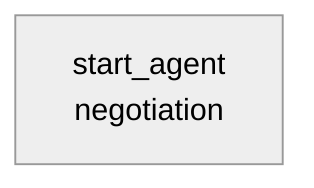

# Agent Spec: Negotiation_Assistant

## Purpose & Scope

Cloud Alpacas의 B2B PRM(스폰서십 영업) 담당자가, 이미 존재하는 Opportunity의 Quote(제안서)에 대해 협상 조건(할인율·유효기한·조건 메모)과 승인 상태를 파악하고, 실제 데이터(예산, 고객 우려사항/반응)에 근거한 협상 전략을 제시하며, 사용자가 명시적으로 확인했을 때만 Quote를 갱신하도록 돕는다. Opportunity 영역 메인 "Opportunity Agent" 산하 5개 전문 Subagent 중 "Negotiation"을 담당하며, 독립 `AiAuthoringBundle`로 개발·테스트한 뒤 메인 담당자가 최종 통합한다(Proposal/Quote 서브에이전트 `Sponsorship_Proposal_Assistant`와 동일한 개발 방식).

## Behavioral Intent

- Quote가 아직 없는 Opportunity는 협상 대상이 없으므로, 먼저 Proposal/Quote 담당 영역에서 제안서를 만들어야 한다고 안내한다(중복 구현 금지).
- 협상 전략/리스크 코멘트는 반드시 조회한 실제 데이터(Quote 상태·할인율·유효기한·소계, Opportunity의 Client Budget/Budget Status, 가장 최근 기록된 Concerns/Objections·Customer Reaction·Key Decision)에 근거해야 하며, 수치나 사실을 추측해서 만들어내지 않는다.
- Quote 필드 갱신(Create/Update)은 사용자가 "이 조건으로 확정해줘", "승인 처리해줘"처럼 **명확하게** 확인했을 때만 실행한다. "나쁘지 않네" 같은 애매한 반응만으로는 실행하지 않는다(팀 방침 §5).
- Delete Action 없음(v1 범위 제외, 팀 방침 §5).
- Proposal/Quote(새 제안서·패키지·가격), Discovery(고객 니즈/요구사항), Deal Intelligence, Activity Management(미팅/Task) 영역 질문은 담당 영역이 아니라고 안내하고 답하지 않는다(팀 방침 §2, 중복 구현 금지).
- 승인 흐름은 별도 Salesforce Approval Process를 새로 만들지 않고, 이미 존재하는 `Quote.Status` 픽리스트(Draft/Needs Review/In Review/Approved/Rejected/Presented/Accepted/Denied)로 표현한다 — org에 Approval Process가 없음을 직접 확인함.
- 협상 조건 갱신은 Proposal/Quote의 "1회성 생성"과 달리 여러 라운드에 걸쳐 반복될 수 있는 정상 행위이므로, 확인 플래그(`terms_confirmed`)는 영구 잠금이 아니라 매 갱신 성공 후 초기화되어 다음 변경 시 재확인을 요구한다.

## Subagent Posture

| Subagent | Posture | Why this posture? | Deterministic controls |
|----------|---------|--------------------|-------------------------|
| negotiation | agentic (with one hard gate) | 협상 전략 제시는 LLM의 주관적 판단 영역이지만, Quote 갱신(쓰기)은 소비자에게 보이는 상태를 바꾸는 결과적 행위이므로 명시적 확인 게이트가 필요 | `update_negotiation_terms`의 `available when @variables.terms_confirmed == True` |

## Subagent Map

단일 도메인(하나의 Opportunity에 대한 협상 검토·조정)이라 별도 Subagent 경계가 필요 없다. Proposal/Quote와 동일하게 `start_agent` 하나로 구성.

## Variables

| Variable | Type / Default | Trusted Writer | Named Consumer | Cause | Reset / Expiry / Correction / Cancel |
|----------|----------------|----------------|-----------------|-------|--------------------------------------|
| `terms_confirmed` | `mutable boolean = False` | `confirm_terms` (`@utils.setVariables`) 액션 | `update_negotiation_terms`의 `available when` 게이트 | 소비자 상태(Quote)를 바꾸는 쓰기 작업이므로 명시적 확인 필요 | `update_negotiation_terms` 성공 시 자동으로 `False`로 재초기화(다음 협상 라운드마다 재확인 요구) |
| `negotiation_quote_id` | `mutable string = ""` | `get_negotiation_context` 출력(`set`) | `update_negotiation_terms` 입력(`quoteId`), `available when`의 존재 체크 | 다음 턴에 정확히 재사용해야 하는 Id — 슬롯필링에 맡기면 오염됨(위 §구현 중 발견한 이슈 참고) | 자연 리셋 없음(매 `get_negotiation_context` 호출 시 최신 값으로 덮어씀) |
| `negotiation_quote_line_item_id` | `mutable string = ""` | `get_negotiation_context` 출력(`set`) | `update_negotiation_terms` 입력(`quoteLineItemId`) | 위와 동일 | 위와 동일 |

## Actions

### get_negotiation_context (negotiation subagent)

- **Target:** `apex://NegotiationContext`
- **Status:** NEEDS CREATION

읽기 전용. Opportunity + 가장 최근 Quote + QuoteLineItem 요약 + 가장 최근 Interaction_Intelligence__c를 한 번에 조회 — 여러 오브젝트 조인이 필요해 표준 액션으로는 부족하므로 Apex 사용(Proposal/Quote의 `OpportunityProposalContext`와 동일한 판단).

#### Inputs

| Name | Type | Required | Source |
|------|------|----------|--------|
| opportunityId | object (`lightning__recordIdType`) | Yes | User input / 현재 화면 컨텍스트 |

#### Outputs

| Name | Type | Visible to User? | Notes |
|------|------|-------------------|-------|
| opportunityName | string | Yes | Opportunity.Name |
| clientBudget | number | Yes | Opportunity.Client_Budget__c (이미 존재, 읽기 전용) |
| clientBudgetStatus | string | Yes | Opportunity.Client_Budget_Status__c |
| hasQuote | boolean | No | 내부 판단용 — Quote 존재 여부. `is_used_by_planner: True` 필요(아래 §구현 중 발견한 이슈 참고) |
| quoteId | object (`lightning__recordIdType`) | No | 내부 — `terms_confirmed`와 별개로 `negotiation_quote_id` 변수에 저장해 `update_negotiation_terms`로 전달 |
| quoteName | string | Yes | Quote.Name |
| quoteStatus | string | Yes | Quote.Status |
| quoteLineItemId | object (`lightning__recordIdType`) | No | 내부 — 주 QuoteLineItem Id. `negotiation_quote_line_item_id` 변수에 저장 |
| quoteDiscount | number | Yes | **QuoteLineItem.Discount**(주 라인 아이템 기준) — 아래 참고: Quote 헤더의 Discount가 아님 |
| quoteExpirationDate | date | Yes | Quote.ExpirationDate |
| quoteGrandTotal | number | Yes | Quote.GrandTotal |
| lineItemsSummary | string | Yes | QuoteLineItem 목록을 사람이 읽기 쉬운 문자열로 합친 것(상품명/수량/단가/할인율/소계) |
| hasInteractionIntelligence | boolean | No | 내부 판단용. `is_used_by_planner: True` |
| concernsObjections | string | Yes | Interaction_Intelligence__c.Concerns_Objections__c — **가장 최근 레코드 1건 기준**(아래 한계 참고) |
| customerReaction | string | Yes | Interaction_Intelligence__c.Customer_Reaction__c |
| keyDecision | string | Yes | Interaction_Intelligence__c.Key_Decision__c |
| followUp | string | Yes | Interaction_Intelligence__c.Follow_Up__c |

**(해결됨, 2026-08-27 v2) 협상에 필요한 6개 관점으로 확장:** 사용자(Aaron)가 실제 협상에 필요한 정보를 6가지로 정리해줘서(① Current Proposal ② Customer Requirements ③ Customer Constraints ④ Negotiation Flexibility ⑤ Decision Context ⑥ Negotiation History) 이를 실제 데이터에 매핑해 반영했다. Deal Intelligence가 DART(외부 기업 정보) API를 전담하기로 확정되어, Negotiation은 외부 웹/뉴스 리서치를 하지 않고 내부 데이터만 사용한다.

| 관점 | 데이터 소스 |
|---|---|
| ① Current Proposal | Quote/QuoteLineItem(기존) |
| ② Customer Requirements | Opportunity.Customer_Needs__c, Key_Requirements__c, Customer_KPI__c |
| ③ Customer Constraints | Client_Budget__c/Status(기존), Target_Start_Season__c, 우려사항(Interaction 이력) |
| ④ Negotiation Flexibility | Partner_Tier__c, Product2.Tier__c — **이 org에 등급별 할인 정책 데이터가 없음을 확인**(Product2 필드도 확인함, Tier 분류만 있고 정책 없음). LLM은 이 신호들을 참고만 하고 구체적 할인 상한선을 단정하지 않도록 지시함. **(2026-08-27 추가 확인) Proposal/Quote 담당(승우)이 Pricebook에 이 데이터를 추가할 예정 — 필드가 확정되면 NegotiationContext에 반영 필요(§아래 대기 항목 참고)** |
| ⑤ Decision Context | ~~OpportunityContactRole 기반 결정권자/영향력자 모델~~ **(2026-08-27 범위 수정)** 팀이 원래 의도한 건 "Account 담당자 Contact" 수준이었음 — `Opportunity.SDO_Sales_Primary_Contact__c`(기존 SDO 데모 필드, 실제 데이터 있음: 이름/직함/이메일/전화)로 단순화. Interaction_Intelligence__c.Key_Decision__c와 함께 제시 |
| ⑥ Negotiation History | **`concernsObjections` 등 4개 단일 필드를 폐기하고 `interactionHistorySummary`(최근 5건)로 교체** — 기존 "최신 1건만 봄" 한계 해결. `activityHistorySummary`(Task+Event 최근 5건씩)를 신규 추가 — 사용자가 제안한 "전화/이메일/방문 등 Activity" 반영 |

Live Preview로 재검증: 두 우려사항 레코드(최신 "Positive만 기록" + 이전 "예산 승인 지연 우려")가 모두 `interactionHistorySummary`에 포함되는 것을 trace로 확인. `customerNeeds` 등 기록이 없는 필드는 LLM이 "기록된 요구사항 없음"이라고 정확히 답하고 지어내지 않음을 확인.

### update_negotiation_terms (negotiation subagent)

- **Target:** `apex://NegotiationTermsUpdater`
- **Status:** NEEDS CREATION

#### 표준 액션 vs Apex 판단

단순 필드 업데이트라 표준 `updateRecord`(`standardInvocableAction://updateRecord`, category: Agentforce, 이 org에 실제 존재 확인함)를 먼저 검토했으나 다음 이유로 보류하고 Apex를 사용한다:
1. `updateRecord`의 갱신 대상 필드(`recordData`)는 `JSON` 타입인데, 이 스킬 참고 문서에는 `standardInvocableAction://` 타겟에 대해 검증된 `complex_data_type_name` 매핑이 없다(전부 `apex://`/`flow://` 기준).
2. 팀 공유 문서(§6 "아직 안 한 것")에 따르면 이 org는 `InvocableActionsApiFamily` 기능이 비활성화되어 있어 Proposal/Quote 팀도 표준 액션 대체 가능 여부를 검증하지 못한 상태다.
3. 검증되지 않은 방식으로 반복 실패하기보다, 이미 이 org에서 컴파일+배포+Live Preview까지 검증된 Proposal/Quote의 Apex 패턴을 그대로 재사용하는 편이 안전하다.

표준 액션 전환 가능성은 §6과 동일하게 "아직 안 한 것"으로 남겨두고, Setup UI에서 직접 확인되면 추후 전환을 검토한다.

#### Inputs

| Name | Type | Required | Source |
|------|------|----------|--------|
| quoteId | object (`lightning__recordIdType`) | Yes | `@variables.negotiation_quote_id` (아래 참고 — 대화 슬롯필링이 아닌 변수 바인딩) |
| quoteLineItemId | object (`lightning__recordIdType`) | discount 전달 시 필수 | `@variables.negotiation_quote_line_item_id` |
| discount | number | No | 사용자가 새로 협상한 할인율 — **QuoteLineItem.Discount**에 적용(Quote 헤더가 아님) |
| expirationDate | date | No | 사용자가 새로 협상한 유효기한 — Quote 헤더 |
| description | string | No | 협상 조건/메모 — Quote 헤더 |
| status | string | No | Draft/Needs Review/In Review/Approved/Rejected/Presented/Accepted/Denied 중 하나 — Quote 헤더 |

#### Outputs

| Name | Type | Visible to User? | Notes |
|------|------|-------------------|-------|
| success | boolean | No | 내부 판단용 |
| updatedStatus | string | Yes | 갱신 후 Quote.Status |
| updatedDiscount | number | Yes | 갱신 후 Quote.Discount |
| updatedExpirationDate | date | Yes | 갱신 후 Quote.ExpirationDate |

#### Stubbing Requirement (NEEDS CREATION — full implementation, not a stub)

- Apex class `NegotiationTermsUpdater`, `@InvocableMethod` `execute`
- 전달된 필드(discount/expirationDate/description/status)만 선택적으로 갱신(Proposal/Quote의 `SponsorshipProposalSaver`와 동일한 "제공된 값만 반영" 패턴), 아무 값도 없으면 예외 발생
- `update as user`로 Quote 갱신 후 재조회해서 결과 반환

## Action Invocation Strategy

| Action | Subagent | Invocation Mode | Why |
|--------|----------|------------------|-----|
| get_negotiation_context | negotiation | Planner slot-fill (`with opportunityId = ...`) | User-initiated; 매 턴 현재 대화에서 Opportunity Id 추출 |
| confirm_terms | negotiation | `@utils.setVariables` | 사용자가 명확하게 확정/승인을 표현했을 때만 LLM이 호출 |
| update_negotiation_terms | negotiation | Planner slot-fill + `available when` 게이트 | 사용자 확인 후에만 실행되어야 하는 소비자 상태 변경 행위 |

## Deterministic Controls

- `update_negotiation_terms` visibility: `available when @variables.terms_confirmed == True` — 트리거: 명시적 사용자 확인. Quote 상태/조건을 바꾸는 되돌리기 어려운 소비자 대면 변경이므로 하드 게이트 필요(팀 방침 §5: Create/Update는 확인 후에만).
- 성공 시 `set @variables.terms_confirmed = False` — 협상은 여러 라운드 반복이 정상이므로(Proposal의 1회성 생성과 다름), 영구 잠금 대신 매번 재확인을 요구해 실수로 이전 확인이 다음 변경에도 적용되는 것을 방지.

## (검토했으나 미구현) 외부 뉴스 조회 시나리오

Company Intelligence 담당(은영님 확인)은 DART Open API(기업 공시/재무)만 다루고, 시의성 있는 뉴스(자금난·M&A·실적 발표 등)는 담당 영역 밖이라 처음엔 Negotiation이 맡는 방향으로 검토했음. Deal Intelligence가 아니라 **Company Intelligence**가 정확한 명칭.

**2026-08-27: 실제 연동은 전면 취소, 시나리오로만 기록.** 네이버 뉴스 검색이 최근(2026-06-25) NAVER API HUB(NAVER Cloud Platform)로 이관되면서 팀/개인 계정과 결제수단 등록이 필요해질 수 있는 것으로 확인되어, 대안으로 카드 등록이 필요 없는 Currents API(무료 티어, 이메일 가입만 필요)까지 검토했으나, 이 정도 외부 연동에 리소스를 쓸 만큼 우선순위가 높지 않다고 판단해 **실제 구현(Named Credential, Custom Metadata, Apex 콜아웃 클래스, get_company_news 액션)을 전부 되돌렸다.** 한 차례 완전히 구현·배포·Live Preview 검증까지 했었고(OpenDartClient와 동일한 패턴), 필요성이 다시 제기되면 그 구현을 참고해서 다시 만들 수 있음 — 다만 그 시점엔 네이버 대신 카드 등록이 필요 없는 대안(Currents API 등)부터 재검토할 것.

이 기능은 v1 범위에 포함하지 않으며, Negotiation Flexibility/Decision Context 등 이미 구현된 6개 관점에는 영향 없음.

## (2026-08-27 반영 완료) Negotiation Flexibility — Pricebook 기반 실제 할인 정책

승우님이 Pricebook 쪽에 할인 유연성 데이터를 추가 완료. `PricebookEntry`에 신규 필드 2개가 생겼고, `NegotiationContext`에 즉시 반영했다:

| 필드 | 타입 | 의미 |
|---|---|---|
| `Max_Discount_Percent__c`("최대 할인율") | Percent | 정가(UnitPrice) 대비 승인 없이 협상 가능한 최대 할인율 |
| `Max_Discounted_Price__c`("최대 할인가") | Currency | 승인 없이 내려갈 수 있는 최소 판매가(하한선) |

- `get_negotiation_context`의 QuoteLineItem 조회에 `PricebookEntry.Max_Discount_Percent__c`/`Max_Discounted_Price__c`를 조인 추가, 출력 `maxDiscountPercent`/`maxDiscountedPrice`로 노출.
- Negotiation Flexibility 관점(④) 지시를 "정책 데이터 없음, 단정 금지"에서 → "이 한도를 명확한 기준으로 제시하고, 초과/미달 시 별도 승인 필요하다고 안내"로 전면 수정.
- `update_negotiation_terms` 확인 직전 단계에 "확정하려는 조건이 한도를 벗어나면 저장 전에 먼저 승인 필요성을 알리고 재확인" 지시 추가 — 다만 하드 `available when` 게이트는 걸지 않음(정책 자체가 "승인하에 예외 허용"을 전제하고, 이미 `terms_confirmed` 확인 게이트가 있어 이중 차단은 과함).
- Permission Set에 `PricebookEntry.Max_Discount_Percent__c`/`Max_Discounted_Price__c` Read 권한 추가(PricebookEntry는 Product2/Pricebook2에서 object 권한을 상속하므로 field 권한만 필요).
- Live Preview로 실제 값(최대 할인율 6%, 최대 할인가 약 10.34억) 기준 응답이 정확히 grounding되는 것까지 trace로 확인.

## (2026-08-27, v2) 치명적 버그 발견 및 수정 — Opportunity Id를 몰라야 정상

**실제 사용자(Manager Lee, Standard User) 테스트에서 발견.** 화면에서 "삼성카드 - 2026 시즌 파트너십 제안 협상 상황 알려줘"라고만(Record Id 없이) 물었더니 "문제가 발생했습니다"라는 raw 에러가 떴다. CLI로 동일 발화를 재현하니 에러는 아니지만 "Opportunity Id(15/18자리)를 알려달라"고 되묻는 것으로 확인됨 — **일반 사용자가 18자리 Record Id를 직접 알고 입력할 거라고 가정한 설계 결함**이었다. `get_negotiation_context`의 `opportunityId` 입력이 처음부터 `lightning__recordIdType`만 받도록 되어 있어서, 딜 이름/고객사 이름으로 말하는 정상적인 사용 방식을 전혀 지원하지 못했다.

**수정:** 신규 Apex `NegotiationOpportunityLookup`(`find_opportunity` 액션) 추가 — 이름/고객사명으로 검색하되, 입력값이 이미 유효한 Id 형태면 이름 검색 없이 바로 그 Id를 검증해서 씀(하나의 액션으로 두 경우 모두 처리). 매칭이 정확히 1건일 때만 `@variables.resolved_opportunity_id`에 저장해 `get_negotiation_context`로 전달(§이슈 2의 "Id는 변수로" 원칙을 그대로 재적용). 0건이면 지어내지 않고 못 찾았다고 답하고, 2건 이상이면 후보 목록을 보여주고 사용자에게 확인받도록 지시 추가. `get_negotiation_context`는 `available when @variables.resolved_opportunity_id != ""`로 게이트해서, Id가 아직 해석되지 않은 채로 호출되는 것을 원천 차단.

Live Preview로 단일 매칭/매칭 없음/복수 매칭 3가지 케이스 전부 검증 완료, Publish+Activate(v2)까지 반영해 실제 라이브 Agent에서도 확인함. **다른 Subagent도 동일한 함정이 있을 가능성이 높다** — Record Id를 입력으로 받는 Action은 전부 "사용자가 이름으로 말했을 때 어떻게 Id를 찾는가"를 반드시 별도로 설계해야 한다. 지금까지 CLI 테스트에서 항상 "(Opportunity Id: ...)"를 명시적으로 같이 줬기 때문에 이 문제가 이 시점까지 드러나지 않았다.

## 구현 중 발견한 이슈 (Live Preview로 검증, 다른 Subagent 개발 시 참고)

1. **Quote.Discount(헤더 레벨)는 QuoteLineItem이 존재하면 어느 프로필로도 쓸 수 없다.** `sf sobject describe`로 확인한 결과 System Administrator를 포함해 이 org의 모든 사용자에게 `updateable: false`였다(FLS 문제 아님 — FieldPermissions에는 대부분 Edit=true인데도 막힘). `update as user`로 Quote.Discount를 갱신하려는 Apex 배포 자체가 컴파일 실패(`Field is not writeable: Quote.Discount`)한다. 실제 할인 협상은 **QuoteLineItem.Discount**(라인 아이템 레벨)에 적용해야 하며, 이 필드는 정상적으로 쓰기 가능하다. Quote/QuoteLineItem 관련 Action을 만들 때는 헤더 필드가 실제로 쓰기 가능한지 `sf sobject describe`로 먼저 확인할 것.
2. **`filter_from_agent: True`만으로는 "다음 Action에 그대로 전달해야 하는 값"을 안전하게 감출 수 없다.** `get_negotiation_context`가 반환한 `quoteId`를 `filter_from_agent: True`로만 표시하고 `update_negotiation_terms`의 `with quoteId = ...`(슬롯필링)로 넘기게 했더니, LLM이 실제 Id 대신 Quote *이름*이나 내부 tool index 같은 그럴듯한 값을 대신 채워 넣어 Apex가 `Invalid id` 오류로 실패했다(Live Preview에서만 드러남 — 로컬 컴파일과 `sf agent validate`는 통과). `is_used_by_planner: True`를 추가해도 완전히 해결되지 않았다. **해결책:** 다음 턴에 정확히 그대로 재사용해야 하는 값(Id 등)은 반드시 `set @variables.x = @outputs.y`로 변수에 저장하고, 소비하는 Action에는 `with param = @variables.x`처럼 변수를 직접 바인딩하라 — `...`(슬롯필링)에 의존하지 마라. Proposal/Quote의 `quote_id` 변수 패턴이 이미 이 원칙을 따르고 있었다.
3. **`available when`에 `and`로 조건을 이어붙일 때, 여러 줄로 나누면(참고 문서의 예시처럼) 컴파일 에러가 날 수 있다.** 이 프로젝트에서는 한 줄로 `available when A and B`처럼 써야 통과했다. 여러 줄 `and` 이어쓰기를 쓰기 전에 먼저 한 줄로 시도해볼 것.
4. **Revenue Scheduling/예약된 매출이 있는 QuoteLineItem은 Discount 수정이 플랫폼 레벨에서 막힌다**(`FIELD_INTEGRITY_EXCEPTION`). 이건 버그가 아니라 실제 Salesforce 표준 동작이며, 사람이 화면에서 직접 수정해도 동일하게 막힌다. Apex에서 별도로 처리하지 않고 에러를 그대로 전파했더니 LLM이 실제 오류 원인("매출이 이미 예약되어 있어 할인 변경 불가")을 있는 그대로 사용자에게 정확히 전달했다 — 별도의 커스텀 에러 핸들링 없이도 grounding이 잘 작동한 사례.

## Architecture Pattern

**Single-subagent.** 하나의 Opportunity에 대한 협상 검토·조정이라는 단일 도메인이라 `start_agent negotiation:` 하나로 충분하다. Router나 별도 guardrail subagent 불필요(Proposal/Quote와 동일 패턴).

## Permission Set Impact (CA_Opportunity_Agent_Access, merge 방식)

- **(v2 추가) `Task`, `Event` objectPermissions Read 추가**, **`Product2.Tier__c` fieldPermissions Read 추가** — Negotiation History/Flexibility 확장에 실제로 사용하는 것을 확인 후 추가. Task/Event는 Read만(Create/Edit 없음 — Activity 생성·관리는 Activity Management 담당, Negotiation은 읽기만 함).
- **(v3 추가) `PricebookEntry.Max_Discount_Percent__c`/`Max_Discounted_Price__c` fieldPermissions Read 추가** — Pricebook 기반 실제 할인 정책 데이터 반영하면서 필요해짐.
- **(v2 추가) `Contact` objectPermissions Read 추가**, **`Opportunity.SDO_Sales_Primary_Contact__c` fieldPermissions Read 추가** — Decision Context를 "담당자 Contact" 수준으로 단순화하면서 실제로 필요해짐.
- **Quote objectPermissions: `allowEdit` false → true 추가.** 현재 Read+Create만 있고 Edit이 없어 `update_negotiation_terms`가 실패한다. 그 외 필드는 전부 표준 필드라 별도 fieldPermissions 불필요(기존 패턴과 일치).
- QuoteLineItem은 Quote에서 object 권한을 상속하므로 별도 objectPermissions 항목 추가하지 않음(Proposal/Quote 팀이 이미 확인한 함정).
- Interaction_Intelligence__c 관련 필드(Concerns_Objections__c 등)는 이미 Read 권한이 있어 추가 불필요.
- Opportunity.Client_Budget__c / Client_Budget_Status__c도 이미 Read+Edit 권한이 있어 추가 불필요(Negotiation은 읽기만 함).
- `CA_Opportunity_Qualification_Access`는 건드리지 않음. Delete 권한 추가 없음.
- **Live Preview 검증을 위해 `CA_Opportunity_Agent_Access`를 Aaron 본인 계정에도 임시로 배정함**(기존에는 은영님 1인만 배정되어 있었음). Permission Set 정의 자체는 위 Quote allowEdit 추가 외에 변경 없음 — 배정(assignment)만 추가.

## 검증 결과 (Live Preview, 실제 org 데이터 기준)

| 시나리오 | 결과 |
|---|---|
| 협상 컨텍스트 조회(d'Alba Short-Term Sponsorship, 실제 예산 2억/제안액 3억/우려사항 데이터) | 실제 데이터에 근거해 정확히 요약, 예산 차이 기반 할인율(33%)까지 스스로 계산해 제안 |
| 애매한 응답("나쁘지 않네")으로 갱신 시도 | 갱신 액션 호출 안 됨(trace로 확인) — 게이트 정상 작동 |
| 명확한 확인("이 조건으로 확정해줘")으로 할인 갱신 시도 | ID 전달 버그 발견 → 수정 → 정상적으로 실제 Id 전달 확인. 단, 해당 QuoteLineItem은 매출이 이미 예약되어 있어 플랫폼 자체가 할인 변경을 거부(§구현 중 발견한 이슈 4번) — 정상적인 플랫폼 동작 |
| 명확한 확인으로 Status/ExpirationDate 갱신 | 실제 Quote 레코드에 정상 반영됨을 SOQL로 직접 재확인(`Status: In Review`, `ExpirationDate: 2027-02-01`) |
| 갱신 성공 후 `terms_confirmed` 재확인 요구 | trace로 `True → False` 리셋 확인 — 다음 라운드 재확인 요구 정상 작동 |
| Quote가 없는 Opportunity에 대한 협상 요청 | "Quote가 없다"고 안내하고 Proposal/Quote 영역으로 안내, 액션 호출 없음 |
| 담당 외 영역(신규 제안서 생성) 요청 | 담당 영역이 아니라고 정확히 안내, 액션 호출 없음 |
| `sf agent validate authoring-bundle` | 통과 |
| Publish / Activate | **완료(2026-08-27, v1)** — Manager Lee(Standard User 프로필) 테스트 접근 요청으로 진행. `CA_Opportunity_Agent_Access`에 `agentAccesses` 추가, `CopilotSalesforceUser` 배정 후 Publish된 Agent로 재검증 완료 |

**아직 검증 못한 것:** 비즈니스 관점에서 "이 협상 전략이 실제 영업 방식에 맞는가"는 도메인 지식이 있는 사람(PRM 담당자)의 판단이 필요해 별도 리뷰가 필요함(아래 팀 공유 메시지 참고).

## Agent Configuration

- **developer_name:** `Negotiation_Assistant`
- **agent_label:** `Negotiation Assistant`
- **agent_type:** `AgentforceEmployeeAgent` — 내부 PRM 담당자용, `access.default_agent_user` 없음
