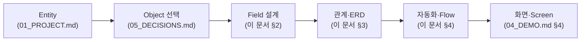
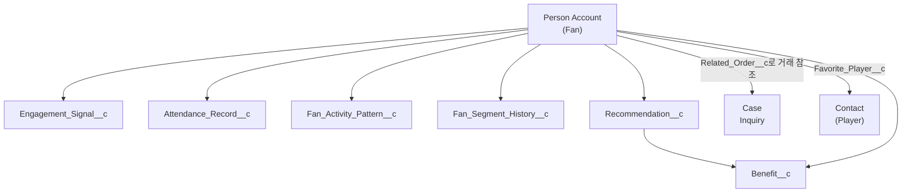
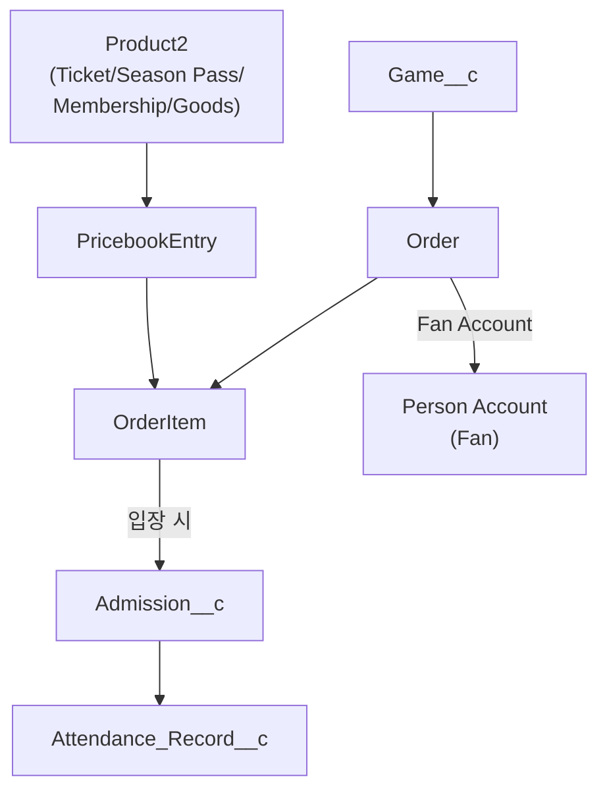
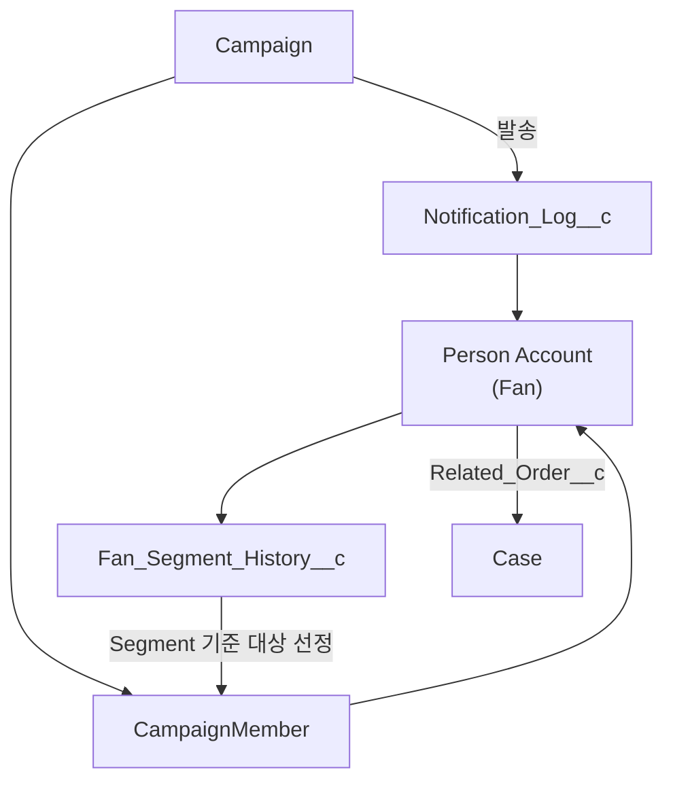
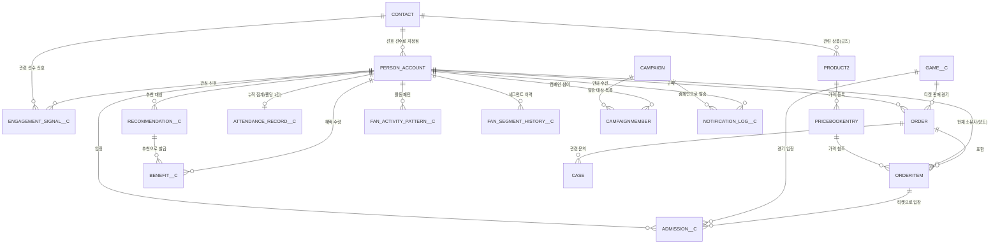
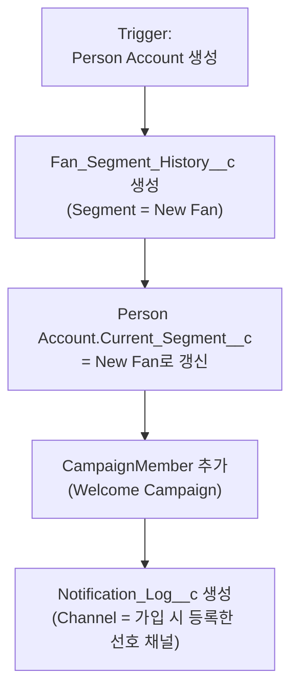
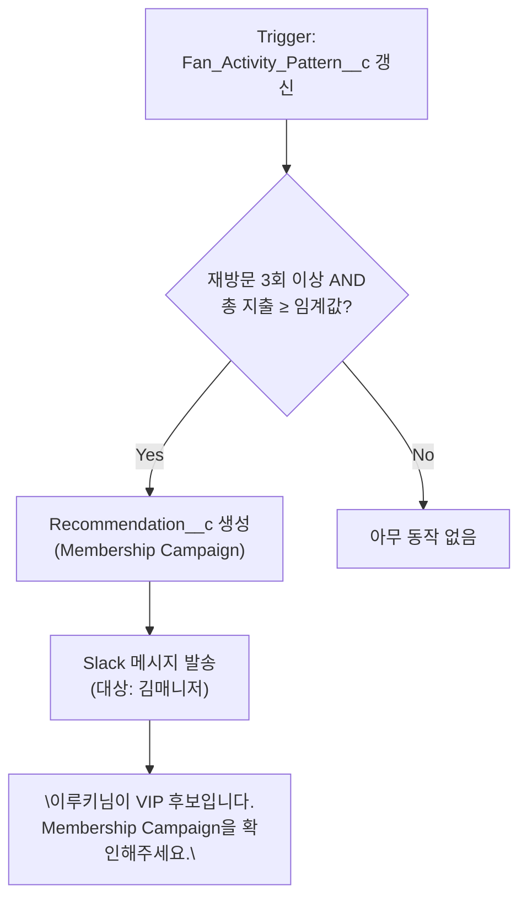

# 03_SYSTEM.md — Cloud Alpacas Salesforce Object / Data Model / Architecture

> 이 문서는 Salesforce Object, Data Model, Architecture, ERD, Flow를 다룬다.
> "어떤 Object를 만들지"에 대한 결정 근거는 `05_DECISIONS.md`(Decision 003~006)에 이미
> 기록되어 있다 — 이 문서는 그 결정을 실제 Object/Field 수준으로 구체화한다.
> Task, Sprint, Bug 같은 진행 상황은 문서가 아니라 GitHub Projects에서 관리한다(CLAUDE.md §7).

---

## 0. 이 문서를 읽는 법

01_PROJECT.md가 "이 세계에 어떤 명사(Entity)가 필요한가"를 정했다면, 이 문서는 그 명사를
**Salesforce 화면과 데이터로 실제로 어떻게 만들 것인가**를 정한다.

이 문서에 나오는 모든 Object 선택은 이미 팀과 함께 확정한 결정이며(05_DECISIONS.md
Decision 003~006), 여기서는 "왜 그렇게 정했는지"를 반복하지 않고 "그래서 Field는
무엇인지"에 집중한다.

---

## 0-1. MVP Implementation Matrix

> **"이 Entity는 이번에 구현하나요?"** 팀원이 이 질문을 할 때 가장 먼저 펼쳐봐야 하는
> 표다. 01_PROJECT.md §4의 Business Entity 전체를 기준으로, MVP 포함 여부와 최종
> 구현 방식을 한 페이지로 요약한다. 이유(Why)는 `05_DECISIONS.md`의 결정을 한 줄로
> 압축한 것이며, 자세한 배경은 표에 적힌 Decision 번호로 `05_DECISIONS.md`에서 찾아
> 읽는다(CLAUDE.md §7 중복 방지 — 이 표는 `05_DECISIONS.md`를 대체하지 않고 요약만
> 한다).
>
> **범례** — MVP: ✅ 포함 / ⛔ 제외(Future Scope) / 🔸 해당 없음(레코드 불필요).
> 구현 방식: `표준 Object` · `Custom Object` · `Field` · `Flow 로직` · `Report/Dashboard` ·
> `Future Scope`.

### 👤 Person

| Business Entity | MVP | 구현 방식 | Why |
|---|---|---|---|
| Fan | ✅ | 표준 Object — Person Account | B2C 개인 고객이 직접 구매·이용의 주체(Decision 004) |
| Player | ✅ | 표준 Object — Contact (RecordType=Player) | 표준 기능으로 충분(01_PROJECT.md §6.1) |
| Staff | ✅ | 표준 Object — User | 별도 설계 불필요 |
| Partner Contact | ⛔ | Future Scope | Sponsorship/Partnership Domain 전체 제외(Decision 005) |

### 🏢 Organization

| Business Entity | MVP | 구현 방식 | Why |
|---|---|---|---|
| Cloud Alpacas | 🔸 | 해당 없음 | 내부 조직 자체는 레코드로 만들지 않음 |
| Sponsor | ⛔ | Future Scope | Decision 005 |
| Partner | ⛔ | Future Scope | Decision 005 |

### 🎫 Product

| Business Entity | MVP | 구현 방식 | Why |
|---|---|---|---|
| Ticket / Season Pass / Membership / Goods | ✅ | 표준 Object — Product2 (RecordType) | 표준 판매 구조가 이미 검증되어 있음(Decision 003) |
| Collaboration Item | ⛔ | Future Scope | Partnership Domain 제외(Decision 005) |
| Benefit | ✅ | Custom Object — `Benefit__c` | 마케팅/멤버십/굿즈 공통 혜택, Recommendation의 결과물(Decision 006) |

### ⚙️ Policy & Eligibility

| Business Entity | MVP | 구현 방식 | Why |
|---|---|---|---|
| Ticket Policy | ✅ | 표준 Object — Price Book Entry | 좌석 등급별 Product2 + 표준 가격 기능으로 충분(Decision 003) |
| Membership Tier | ✅ | Field — Product2.`Tier__c` + Price Book Entry | 등급도 Product2 RecordType 안에서 표현(Decision 003, 03_SYSTEM.md §2.3) |
| Sponsorship Package | ⛔ | Future Scope | Decision 005 |
| Eligibility Rule | ✅ | Flow 로직 (Object 없음) | 규칙 종류가 적고 자주 안 바뀜(Decision 004) |

### ⚾ Event

| Business Entity | MVP | 구현 방식 | Why |
|---|---|---|---|
| Game | ✅ | Custom Object — `Game__c` | 표준 Object 없음(03_SYSTEM.md §1.2) |
| Campaign | ✅ | 표준 Object — Campaign/CampaignMember | Marketing 관점에서 그대로 재사용(01_PROJECT.md §6.1) |
| Fan Meeting | ✅ | 표준 Object — Campaign 재사용 (별도 구현 없음) | 01_PROJECT.md §6.1 제안대로 Campaign으로 흡수. **주의**: 04_DEMO.md에 아직 별도 Scene이 없다 — 실제로 쓰일지 팀 확인 필요 |

### 💰 Transaction

| Business Entity | MVP | 구현 방식 | Why |
|---|---|---|---|
| Ticket Purchase / Goods Purchase / Membership Enrollment | ✅ | 표준 Object — Order/OrderItem (`Order_Type__c`로 구분) | 셀프서비스형 거래에 적합(Decision 003) |
| Ticket Transfer | ✅ | Field — OrderItem.`Current_Owner__c`/`Transfer_Status__c` | 양도가 핵심 비즈니스가 아니고 이력 추적이 이번 범위 밖(Decision 004) |
| Admission | ✅ | Custom Object — `Admission__c` | "몇 번 왔는가"와 "언제 왔는가"를 구분해야 함(01_PROJECT.md §3.1) |
| Shipment | ⛔ | Future Scope | 이 프로젝트의 목적은 물류가 아니라 Customer 360(Decision 006) |
| Return | ⛔ | Future Scope | Decision 006 |
| Benefit Redemption | ⛔ | Future Scope (Field로 대체) | `Benefit__c.Status__c`(Issued/Used/Expired)로 충분(Decision 006) |
| Renewal | ⛔ | Future Scope (Field로 대체) | Order.`Membership_Status__c`/`Membership_End_Date__c` 상태 전이로 충분(Decision 004) |
| Proposal / Sponsor Contract / Settlement | ⛔ | Future Scope | Sponsorship/Partnership Domain 제외(Decision 005) |

### 📍 Location

| Business Entity | MVP | 구현 방식 | Why |
|---|---|---|---|
| Ballpark | ⛔ | Future Scope | 단일 홈구장 MVP — 별도 Object 불필요(Decision 006) |
| Section / Seat | ✅ | Field — OrderItem.`Section__c`/`Row__c`/`Seat_Number__c` | 구매 시점 정보이며 필드만으로 충분(Decision 006) |
| Gate | ✅ | Field — `Admission__c.Gate__c` | 입장 시점 정보(Decision 006) |
| Partner Store | ⛔ | Future Scope | Partnership Domain 제외(Decision 005) |

### 💬 Service

| Business Entity | MVP | 구현 방식 | Why |
|---|---|---|---|
| Inquiry | ✅ | 표준 Object — Case | 표준 문의 처리 기능으로 충분(01_PROJECT.md §6.1) |
| Notification | ✅ | Custom Object — `Notification_Log__c` | Fan Timeline의 핵심 데이터, 발송 이력이 남아야 함(Decision 006) |
| Marketing Consent | ✅ | Field — Person Account.`Email/SMS/Push/Kakao_Opt_In__c` | 감사(Audit) 목적 이력 추적이 이번 범위 밖(Decision 004) |

### 📊 Analytics

| Business Entity | MVP | 구현 방식 | Why |
|---|---|---|---|
| Attendance Record | ✅ | Custom Object — `Attendance_Record__c` | Admission 여러 건을 집계한 분석 결과, 자동화 트리거로 필요(Decision 003) |
| Engagement Signal | ✅ | Custom Object — `Engagement_Signal__c` | 구매 이전 관심 신호를 기록(Decision 003) |
| Fan Activity Pattern | ✅ | Custom Object — `Fan_Activity_Pattern__c` | VIP 후보 감지 Flow의 트리거 근거(Decision 003) |
| Fan Segment (Current Segment/Life Cycle 축만 — Decision 009) | ✅ | Custom Object — `Fan_Segment_History__c` + Field(`Current_Segment__c` 캐시). Engagement Level/Fan Value 두 축은 §2.1의 `Engagement_Level__c`/`Engagement_Score__c`/`Fan_Value_Tier__c` Field로 별도 관리 | "언제 상태가 바뀌었는지"가 자동화의 근거(Decision 003) |
| Recommendation | ✅ | Custom Object — `Recommendation__c` | 시스템이 생성한 Next Best Action 결과물(01_PROJECT.md §3.1) |
| Campaign Performance | ✅ | Report/Dashboard (Object 없음) | Marketing 관점 집계만 필요, 별도 저장 불필요(01_PROJECT.md §6.1) |
| Sponsor Performance | ⛔ | Future Scope | Partnership Domain 제외(Decision 005) |

---

## 1. Object 전체 지도

### 1.1 표준 Object를 그대로 쓰는 것

| Object | 표현하는 것 | 비고 |
|---|---|---|
| Person Account | Fan | Decision 003 |
| Contact | Player (RecordType = Player) | 01_PROJECT.md §6.1 |
| User | Staff | 별도 설계 불필요 |
| Product2 | Ticket / Season Pass / Membership / Goods | Decision 003 |
| Price Book / Price Book Entry | Ticket Policy / Membership Tier의 가격 | Decision 003 |
| Order / OrderItem | Ticket Purchase / Goods Purchase / Membership Enrollment | Decision 003 |
| Campaign / CampaignMember | 마케팅 캠페인, 발송 대상 | 01_PROJECT.md §6.1 |
| Case | Inquiry (팬 문의) | 01_PROJECT.md §6.1 |

### 1.2 새로 만드는 Custom Object

| Object (API Name) | 표현하는 것 | 왜 Custom Object가 필요한가 |
|---|---|---|
| `Game__c` | 경기 | 표준 Object가 없다. |
| `Admission__c` | 게이트 통과 1건(개별 입장 사건) | "몇 번 왔는가"와 "언제 왔는가"를 구분해야 한다(01_PROJECT.md §3.1). |
| `Benefit__c` | 팬이 받은 쿠폰·할인·선예매권 | Recommendation의 결과로 발급되는 혜택. 사용 여부는 Status 필드로 관리(Decision 006). |
| `Notification_Log__c` | 팬에게 보낸 개인화 안내 이력 | Fan Timeline의 핵심 데이터(Decision 006). |
| `Attendance_Record__c` | 팬의 누적 관람 이력 | Admission 여러 건을 집계한 분석 결과(Decision 003). |
| `Engagement_Signal__c` | SNS 반응 등 관심 신호 | 이루키가 SNS에서 문선수 영상을 본 것처럼, 구매 이전의 관심 신호를 기록(Decision 003). |
| `Fan_Activity_Pattern__c` | 팬의 시즌별 활동 패턴 | 여러 활동을 묶어 분석한 결과(Decision 003). |
| `Fan_Segment_History__c` | 팬의 Segment(상태) 변화 이력 | "언제 어떤 상태였는지" 시점을 남겨야 자동화의 근거가 된다(Decision 003). |
| `Recommendation__c` | 팬별 Next Best Action 추천 결과 | 시스템(구단)이 생성한 결과물(01_PROJECT.md §3.1). |

### 1.3 이번에 만들지 않는 것 (Future Scope)

Ballpark/Section/Seat/Gate 개별 Object, Benefit Redemption, Shipment, Return,
Eligibility Rule Object, Ticket Transfer 이력 Object, Marketing Consent 이력 Object,
Renewal Object, 그리고 Sponsor/Partner 계열 전체(Decision 005) — 이유와 확장 조건은
`05_DECISIONS.md`와 이 문서 §5 Future Scope에 정리했다.

---

## 2. Object 상세 (Field 정의)

### 2.1 Person Account — Fan

Fan은 표준 Person Account 필드(이름, 이메일, 휴대폰 등)에 아래 필드를 추가한다.

| Field (API Name) | 타입 | 설명 |
|---|---|---|
| `Favorite_Player__c` | Lookup(Contact) | 최애 선수. Favorite Player Campaign, 개인화 굿즈 추천에 사용. |
| `Acquisition_Channel__c` | Picklist (SNS/지인 추천/검색/오프라인 등) | 이루키처럼 "SNS에서 처음 알게 됨"을 기록 — Pain Point 1(팬 정보 흩어짐) 해결. |
| `Current_Segment__c` | Picklist (New Fan/Active Fan/At-Risk Fan/Dormant Fan/Churned Fan/Unreachable Fan) | 00_STORY.md §6 Current Segment(Life Cycle) — "지금 이 팬이 활동 주기의 어디에 있는가". `Fan_Segment_History__c`의 최신 값을 캐시. |
| `Segment_Updated_Date__c` | Date | 현재 Segment(Life Cycle)로 바뀐 날짜. |
| `Engagement_Level__c` | Picklist (가입 팬/관심 팬/활동 팬/충성 팬/멤버십 팬/핵심 팬) | "이 팬이 우리와 얼마나 깊게 관계를 맺고 있는가" — Current Segment와는 다른 축(Decision 009·010). |
| `Engagement_Score__c` | Number | Engagement Level을 산출하는 근거 점수. **필드는 이번 MVP에 포함하되, 점수 계산 공식과 자동 계산 방식(Flow/Apex 등)은 아직 미확정(TBD)** — 임의의 배점(예: 관람 30점 + 구매 40점 + 활동 30점)을 지금 확정하지 않는다. §5 Future Scope 참고(Decision 010). |
| `Fan_Value_Tier__c` | Picklist (일반/우수/VIP) | "이 팬이 우리에게 얼마나 가치 있는 고객인가" — Current Segment·Engagement Level과는 다른 축(Decision 009·010). **VIP는 이 필드의 값이며, Product2.`Tier__c`의 "VIP" 멤버십 등급과는 다른 개념**이다. Flow/Demo의 "VIP 후보"는 이 필드가 VIP로 바뀔 가능성이 높다는 뜻이지, 자동으로 VIP를 확정하는 것이 아니다(§4.5 참고). |
| `Email_Opt_In__c` / `SMS_Opt_In__c` / `Push_Opt_In__c` / `Kakao_Opt_In__c` | Checkbox | 채널별 마케팅 수신 동의(Decision 004 — Marketing Consent를 필드로 관리). |
| `Consent_Updated_Date__c` | Date | 동의 값이 마지막으로 바뀐 날짜. |

> **왜 Current_Segment__c와 Fan_Segment_History__c를 둘 다 두나?** Fan 목록 화면에서
> 매번 "이 팬의 최신 상태"를 계산하면 느리다. 그래서 최신 값은 Fan 레코드에 캐시해두고
> (`Current_Segment__c`), "언제 어떻게 바뀌었는지"는 별도 이력 Object에 남긴다. 냉장고
> 문에 "오늘 할 일"을 붙여두고, 지난 할 일들은 수첩에 기록해두는 것과 같다.
>
> **`Engagement_Level__c`/`Engagement_Score__c`/`Fan_Value_Tier__c`에는 왜 이력
> Object가 없나?** Fan 분류 3축(Decision 009) 중 Current Segment만
> `Fan_Segment_History__c`라는 이력 Object를 갖고, 나머지 두 축(Engagement Level·Fan
> Value)은 이번 MVP에서 Person Account의 캐시 필드로만 관리한다 — Object 개수를 필요한
> 만큼만 늘리는 원칙(Decision 006) 때문이다. **`Fan_Segment_History__c`는 Current
> Segment(Life Cycle) 변경 이력 전용이며, Engagement Level이나 Fan Value 변경까지 이
> Object 하나로 함께 기록하도록 확장하지 않는다(Decision 010)** — 세 축을 혼용하지
> 않는다는 원칙을 이력 Object 구조에도 그대로 적용한 것이다. "언제 Engagement
> Level/Fan Value가 바뀌었는지"를 자동화 트리거 근거로 남겨야 할 정도로 중요해지면,
> `Fan_Segment_History__c`와 같은 패턴의 별도 이력 Object를 추가한다(§5 Future Scope).

> **Owner(표준 `OwnerId`)는 이 3축과 완전히 별개다(Decision 009)**. `OwnerId`(담당
> 직원)는 표준 필드로 자동 존재하며 별도 설계가 필요 없다 — 예를 들어 김매니저가
> `OwnerId`인 Fan이 동시에 `Fan_Value_Tier__c` = VIP이면서 `Current_Segment__c` =
> At-Risk Fan일 수 있다. 현재는 김매니저 1명뿐이라 OWD/Sharing Rule/Role 기반 접근
> 제한은 구현하지 않는다(OWD를 Private으로 바꾸거나 VIP 담당자별 Sharing Rule을
> 새로 만들지 않는다) — Staff가 늘어나면 §5 Future Scope에서 다시 결정한다.

### 2.2 Contact — Player

RecordType = `Player`로 구분한다.

| Field (API Name) | 타입 | 설명 |
|---|---|---|
| `Position__c` | Picklist | 포지션. |
| `Uniform_Number__c` | Number | 등번호. |

### 2.3 Product2 — Ticket / Season Pass / Membership / Goods

RecordType으로 4종을 구분한다. 공통 필드(Name, ProductCode, IsActive, Description)는
표준 그대로 쓴다.

| Field (API Name) | 타입 | 어느 RecordType에서 쓰나 | 설명 |
|---|---|---|---|
| `Tier__c` | Picklist (Standard/Premium/VIP 등) | Membership | Membership Tier. 등급마다 별도 Product2 레코드로 만들고, 가격은 Price Book Entry로 매긴다. |
| `Category__c` | Picklist (Uniform/Cheering Item/Accessory) | Goods | 굿즈 카테고리(01_PROJECT.md §3.4 — 지금은 필드, 나중에 분석이 중요해지면 Object 승격 가능). |
| `Related_Player__c` | Lookup(Contact) | Goods | 이 굿즈가 특정 선수 관련 상품인지(예: "문선수 유니폼"). Favorite Player Campaign 추천 근거. |

가격(Ticket Policy/Membership Tier의 가격)은 **Price Book Entry**로 관리한다 — 좌석 등급별
가격이 다르면, 좌석 등급별로 별도 Product2를 만들고(예: "Ticket - 1루 응원석", "Ticket -
외야석") 각각 Price Book Entry를 매긴다.

### 2.4 Order / OrderItem — Ticket Purchase / Goods Purchase / Membership Enrollment

| Field (API Name) | Object | 타입 | 설명 |
|---|---|---|---|
| `Order_Type__c` | Order | Picklist (Ticket Purchase/Goods Purchase/Membership Enrollment) | 세 가지 거래를 구분. |
| `Purchase_Channel__c` | Order | Picklist (온라인/구장 굿즈샵) | 온라인 구매인지 구장 현장(굿즈샵) 구매인지 구분. Fan Journey/Fan Profile/Dashboard/Recommendation에서 채널별로 활용(Decision 009). |
| `Game__c` | Order | Lookup(`Game__c`) | Ticket Purchase 전용 — 어느 경기 티켓인지. |
| `Membership_Status__c` | Order | Picklist (Active/Expired/Cancelled) | Membership Enrollment 전용. Renewal은 이 값의 상태 전이로 처리(Decision 004). |
| `Membership_End_Date__c` | Order | Date | Membership Enrollment 전용. 갱신 임박 판단 기준. |
| `Section__c` / `Row__c` / `Seat_Number__c` | OrderItem | Picklist/Text/Text | Ticket Purchase 전용 — 구매 시점에 정해지는 좌석 정보(Decision 006). |
| `Current_Owner__c` | OrderItem | Lookup(Person Account) | 기본값은 구매자. 선물·양도 시 실제 입장자로 변경(Ticket Transfer, Decision 004). |
| `Transfer_Status__c` | OrderItem | Picklist (Not Transferred/Transferred) | 양도 여부. |

> **왜 좌석 정보는 OrderItem에, 게이트 정보는 Admission에 있나?** 좌석은 "표를 살 때"
> 정해지고, 게이트는 "실제로 입장할 때" 결정된다 — 서로 다른 시점의 정보라 다른
> Object에 둔다(05_DECISIONS.md Decision 006 영향 참고).

### 2.5 Game__c

| Field (API Name) | 타입 | 설명 |
|---|---|---|
| `Game_Date__c` | DateTime | 경기 일시. |
| `Opponent__c` | Text | 상대팀. |
| `Result__c` | Picklist (Win/Loss/Draw) | 경기 결과(선택). |

### 2.6 Admission__c

| Field (API Name) | 타입 | 설명 |
|---|---|---|
| `Fan__c` | Lookup(Person Account) | 누가 입장했나. |
| `Game__c` | Lookup(`Game__c`) | 어느 경기인가. |
| `Order_Item__c` | Lookup(OrderItem) | 어떤 티켓으로 입장했나. |
| `Admission_Time__c` | DateTime | 입장 시각. |
| `Gate__c` | Picklist (Gate 1~4) | 통과한 게이트(Decision 006). |

### 2.7 Benefit__c

| Field (API Name) | 타입 | 설명 |
|---|---|---|
| `Fan__c` | Lookup(Person Account) | 누구에게 발급됐나. |
| `Benefit_Type__c` | Picklist (Coupon/Discount/Early Access/Membership Day Invite) | 혜택 종류. |
| `Recommendation__c` | Lookup(`Recommendation__c`) | 이 혜택을 발급하게 만든 추천(있는 경우). |
| `Status__c` | Picklist (Issued/Used/Expired) | 발급/사용/만료(Decision 006 — Redemption Object 대신 상태 필드로 관리). |
| `Issued_Date__c` / `Used_Date__c` / `Expiration_Date__c` | Date | 발급·사용·만료 일자. |

### 2.8 Case — Inquiry

| Field (API Name) | 타입 | 설명 |
|---|---|---|
| `Related_Order__c` | Lookup(Order) | 이 문의가 어떤 Ticket/Goods/Membership 거래에 대한 것인지(01_PROJECT.md §5). |

Subject/Description/Status/Origin 등은 표준 필드를 그대로 쓴다.

### 2.9 Notification_Log__c

| Field (API Name) | 타입 | 설명 |
|---|---|---|
| `Fan__c` | Lookup(Person Account) | 누구에게 보냈나. |
| `Campaign__c` | Lookup(Campaign) | 어떤 캠페인으로 보냈나. |
| `Channel__c` | Picklist (Email/SMS/Push/Kakao AlimTalk) | 발송 채널 — 팬에게 보내는 채널이며, 김매니저가 받는 Slack과는 다른 목적이다(§4.3 참고). |
| `Content__c` | Long Text Area | 발송 내용. |
| `Sent_Date__c` | DateTime | 발송 시각. |

### 2.10 Attendance_Record__c

| Field (API Name) | 타입 | 설명 |
|---|---|---|
| `Fan__c` | Lookup(Person Account), 팬당 1건 | 누구의 기록인가. |
| `Total_Admissions__c` | Number | 누적 관람 횟수. |
| `First_Admission_Date__c` / `Last_Admission_Date__c` | Date | 첫 관람일 / 최근 관람일. |

### 2.11 Engagement_Signal__c

| Field (API Name) | 타입 | 설명 |
|---|---|---|
| `Fan__c` | Lookup(Person Account) | 누구의 신호인가. |
| `Signal_Type__c` | Picklist (SNS Click/Video View/App Open) | 신호 종류. |
| `Source__c` | Text | 예: Instagram, YouTube. |
| `Player__c` | Lookup(Contact) | 어떤 선수와 관련된 신호인지(선택 — "문선수 영상"처럼). |
| `Signal_Date__c` | DateTime | 발생 시각. |

### 2.12 Fan_Activity_Pattern__c

| Field (API Name) | 타입 | 설명 |
|---|---|---|
| `Fan__c` | Lookup(Person Account) | 누구의 패턴인가. |
| `Period__c` | Text | 분석 기간(예: "2026 시즌"). |
| `Games_Attended__c` | Number | 이 기간 관람 횟수. |
| `Goods_Purchases__c` | Number | 이 기간 굿즈 구매 횟수. |
| `Total_Spend__c` | Currency | 이 기간 총 지출. |
| `Analyzed_Date__c` | Date | 분석이 실행된 날짜. |

### 2.13 Fan_Segment_History__c

| Field (API Name) | 타입 | 설명 |
|---|---|---|
| `Fan__c` | Lookup(Person Account) | 누구의 이력인가. |
| `Segment__c` | Picklist (00_STORY.md §6과 동일한 6개 값) | 그 시점의 Current Segment(Life Cycle). |
| `Changed_Date__c` | DateTime | Current Segment(Life Cycle)가 바뀐 시각. |
| `Reason__c` | Text | 예: "최초 가입", "90일 무활동". |

### 2.14 Recommendation__c

| Field (API Name) | 타입 | 설명 |
|---|---|---|
| `Fan__c` | Lookup(Person Account) | 누구를 위한 추천인가. |
| `Recommended_Action__c` | Picklist (00_STORY.md §7 NBA 6종) | 무엇을 추천하나. |
| `Reason__c` | Text | 왜 이 추천이 나왔나(예: "3경기 연속 관람, 굿즈 미구매"). |
| `Status__c` | Picklist (Pending/Executed/Dismissed) | 김매니저가 이 추천을 실행했는지. |

---

## 3. ERD — Object 간 관계

### 3.1 Fan 축 — 팬이 누구고, 무엇을 하고 있는가

### 3.2 Operations 축 — 구단이 파는 것

### 3.3 Marketing/Service 축 — 알리고, 대응하는 것

### 3.4 Relationship Summary — 전체 관계 표 (공식 버전)

§3.1~3.3의 3개 다이어그램에 흩어진 관계를 하나도 빠짐없이 모은 표준 `erDiagram`이다.
Baby Team 워크숍(`workshop/`)에서 그림으로 먼저 논의한 뒤, 이 블록으로 옮겨 공식화한
것이다 — 이후 관계가 바뀌면 이 코드를 고치고 아래 표도 함께 갱신한다.

| Parent | Child | Cardinality | Meaning |
|---|---|---|---|
| Contact (Player) | Person Account (Fan) | 1:N | 한 선수는 여러 팬의 "최애 선수"가 될 수 있다 |
| Contact (Player) | Product2 (Goods) | 1:N | 한 선수는 여러 굿즈에 연결될 수 있다 |
| Contact (Player) | `Engagement_Signal__c` | 1:N | 한 선수는 여러 관심 신호에 등장할 수 있다 |
| Product2 | PricebookEntry | 1:N | 한 상품은 여러 가격(좌석 등급별 등)을 가질 수 있다 |
| PricebookEntry | OrderItem | 1:N | 한 가격 기준이 여러 주문 항목에 적용된다 |
| Person Account (Fan) | Order | 1:N | 한 팬은 여러 번 구매한다 |
| Person Account (Fan) | OrderItem | 1:N | 팬은 (양도로) 다른 팬 티켓의 현재 소유자가 될 수 있다 |
| `Game__c` | Order | 1:N | 한 경기에 여러 티켓 주문이 발생한다 |
| Order | OrderItem | 1:N | 표준 Master-Detail |
| Person Account (Fan) | `Admission__c` | 1:N | 한 팬은 여러 번 입장한다 |
| `Game__c` | `Admission__c` | 1:N | 한 경기에 여러 입장 기록이 쌓인다 |
| OrderItem | `Admission__c` | 1:N | 티켓 1건으로 입장 기록이 생긴다 |
| Person Account (Fan) | `Attendance_Record__c` | 1:1 | 팬당 누적 집계 레코드는 1건 |
| Person Account (Fan) | `Recommendation__c` | 1:N | 한 팬에게 여러 추천이 쌓인다 |
| `Recommendation__c` | `Benefit__c` | 1:N | 추천 하나가 혜택 발급으로 이어질 수 있다 |
| Person Account (Fan) | `Benefit__c` | 1:N | 한 팬은 여러 혜택을 받을 수 있다 |
| Person Account (Fan) | `Fan_Activity_Pattern__c` | 1:N | 시즌/기간별로 여러 건 쌓일 수 있다 |
| Person Account (Fan) | `Fan_Segment_History__c` | 1:N | Segment가 바뀔 때마다 이력이 쌓인다 |
| Person Account (Fan) | `Engagement_Signal__c` | 1:N | 관심 신호가 여러 번 기록된다 |
| Campaign | CampaignMember | 1:N | 표준 발송 대상 목록 |
| Person Account (Fan) | CampaignMember | 1:N | 한 팬이 여러 캠페인에 속할 수 있다 |
| Campaign | `Notification_Log__c` | 1:N | 캠페인 하나로 여러 건이 발송된다 |
| Person Account (Fan) | `Notification_Log__c` | 1:N | 한 팬에게 여러 안내가 쌓인다(Fan Timeline) |
| Order | Case | 1:N | 한 거래에 여러 문의가 달릴 수 있다 |

> Campaign이 Fan Meeting(01_PROJECT.md §6.1 제안)까지 표현할지는 아직 팀 결정이
> 없어 이 표에 넣지 않았다 — 확정되면 이 표와 위 erDiagram에 한 줄을 추가한다.

---

## 4. Flow 설계

### 4.1 왜 Flow가 필요한가

00_STORY.md §7(FRM Team의 Next Best Action)은 "팬의 상태"와 "그에 맞는 행동"을 표로
정리했다. 이 표를 사람이 매번 엑셀을 보고 판단하면 Pain Point 4("VIP가 될 가능성이 높은
팬도 엑셀을 정리한 후에야 발견한다")가 그대로 반복된다. Salesforce Flow는 이 판단을
**자동으로, 그 즉시** 실행해주는 도구다.

### 4.2 Trigger → Action 매핑 (00_STORY.md §7 기반)

| 팬의 상태 (Trigger) | Flow가 하는 일 | 김매니저에게 Slack 알림? |
|---|---|---|
| Person Account 신규 생성 | `Fan_Segment_History__c`(New Fan) 생성, Welcome Campaign `CampaignMember` 추가, `Notification_Log__c` 생성(Welcome 안내 발송) | 아니오 (일상적 신규가입은 자동 처리) |
| 가입 후 7일간 Ticket Purchase 없음 | First Ticket Campaign `CampaignMember` 추가, `Notification_Log__c` 생성 | 아니오 |
| `Admission__c` 최초 1건 생성 | Segment를 Active Fan으로 변경(`Fan_Segment_History__c` 추가), First Visit Guide 발송 | 아니오 |
| 관람은 했지만 Goods Purchase 없음(Ticket Only Fan) | First Merchandise Campaign 추천(`Recommendation__c` 생성), `Benefit__c`(할인 쿠폰) 발급 | 아니오 |
| 첫 Goods Purchase 완료 | Favorite Player Campaign 추천(`Recommendation__c` 생성) | 아니오 |
| `Fan_Activity_Pattern__c`가 "재방문 3회 이상 + 총 지출 임계값 이상" 조건 충족 (VIP/멤버십 후보) | Membership Campaign 추천(`Recommendation__c` 생성) | **예 — "VIP 후보 발견" 알림** |
| `Fan_Segment_History__c`가 At-Risk Fan으로 전환 | Win-back Campaign 추천 *(향후)* | **예 — "이탈 위험 팬" 알림** |

> 표의 마지막 두 줄처럼 **"놓치면 아까운 타이밍"**만 Slack으로 김매니저에게 알린다.
> 나머지는 시스템이 조용히 자동으로 처리한다 — 모든 이벤트를 다 알리면 진짜 중요한
> 알림이 묻히기 때문이다.

### 4.3 Notification_Log__c와 Slack 알림의 차이

이 프로젝트에는 "알림"이 두 종류 있다. 서로 받는 사람도, 목적도 다르다.

| | Notification_Log__c | Slack 알림 |
|---|---|---|
| 받는 사람 | 팬 (이루키) | 김매니저 (FRM 담당자) |
| 채널 | Email/SMS/Push/카카오 알림톡 | Slack |
| 목적 | 팬에게 정보·혜택을 안내 | 김매니저가 놓치면 안 되는 팬 상태 변화를 알림 |
| 어디서 보이나 | Fan Timeline (팬의 이력) | Slack 채널 (김매니저의 업무 도구) |

> **비유**: Notification_Log__c는 "가게가 손님에게 보내는 문자"이고, Slack 알림은
> "매니저 휴대폰에 뜨는 사내 업무 알림"입니다. 같은 사건(예: 이루키가 VIP 후보가 됨)이
> 두 가지 다른 알림을 만들어낼 수 있습니다 — 이루키에게는 "특별한 혜택을 준비했어요"
> 안내가, 김매니저에게는 "이루키님을 확인해보세요"라는 업무 알림이 갑니다.

### 4.4 대표 Flow 예시 ① — Welcome Campaign Flow

### 4.5 대표 Flow 예시 ② — VIP 후보 감지 Flow

> **용어 확인(Decision 009·010)**: 이 Flow가 감지하는 "VIP 후보"는 **Fan Value가
> VIP로 바뀔 가능성이 높은 팬**(Recommendation/판단 대상)을 뜻하며, `Fan_Value_Tier__c`
> 값 자체가 아니다. 흐름은 항상 다음 순서를 따른다:
>
> `Fan_Activity_Pattern__c`(행동 데이터) 기준 VIP 조건 충족 감지 → `Recommendation__c`
> 생성 → 김매니저(담당자)에게 Slack 알림 → **김매니저가 확인** → 필요 시 김매니저가
> 직접 Person Account.`Fan_Value_Tier__c`를 VIP로 변경(수동).
>
> 이 Flow는 `Recommendation__c`를 만들고 김매니저에게 알릴 뿐, `Fan_Value_Tier__c`를
> 자동으로 VIP로 확정하지 않는다 — "VIP 후보 감지" ≠ "Fan Value = VIP 자동 변경".

### 4.6 아직 정의되지 않은 Trigger — 구현 전 확정 필요

§4.2 표의 Flow 중 "경과 시간"이나 "누적값"을 조건으로 삼는 Flow는, **그 값을 누가
언제 계산해서 채워 넣는지**가 아직 정의되어 있지 않다. Record-Triggered Flow는
레코드가 생성·수정될 때만 실행되는데, "가입 후 7일 경과"나 "무활동 90일" 같은
조건은 아무 레코드 변경 없이도 시간이 지나면 참이 되기 때문이다.

| Flow | 빠진 부분 |
|---|---|
| First Ticket Campaign (2번) | "가입 후 7일 경과"를 누가 매일 검사하는가 |
| First Merchandise Campaign (4번) | "관람했지만 굿즈 미구매" 상태를 언제 검사하는가 |
| VIP 후보 감지 (6번) | 트리거 조건인 `Fan_Activity_Pattern__c` 자체를 **누가 갱신하는가** — 이 계산 Flow가 없다 |
| Win-back Campaign (7번) | "무활동 90일"을 누가 매일 검사하는가 |

**구현 전 결정할 것**: 매일 정해진 시간에 도는 Scheduled-Triggered Flow(가칭
"Daily Fan Analytics Refresh") 1개를 새로 설계해, `Fan_Activity_Pattern__c` 재계산과
위 4개 Flow의 조건 검사를 여기서 함께 처리할지 팀이 확정한다. 이 Flow의 실행
시각에 맞춰 `04_DEMO.md` §5 Sample Data의 날짜도 역산해서 만들어야 한다.

---

## 5. Future Scope

`05_DECISIONS.md`에서 이미 기록한 확장 지점을 한곳에 모았다 — 새 결정이 아니라 참조용
요약이며(CLAUDE.md §7 중복 방지 원칙), 자세한 배경은 각 Decision을 참고한다.

| 지금은 없음 | 나중에 필요해지면 | 근거 |
|---|---|---|
| Ballpark/Section/Seat/Gate Object | 다구장 운영, 좌석 상태 관리 | Decision 006 |
| Benefit Redemption Object | 혜택 사용 이력 분석·정산 | Decision 006 |
| Shipment / Return Object | 배송 추적, 교환·반품 처리 | Decision 006 |
| Eligibility Rule Object | 자격 규칙이 많아지고 자주 바뀔 때 | Decision 004 |
| Ticket Transfer 이력 Object | 양도 CS 문의가 잦아질 때 | Decision 004 |
| Marketing Consent 이력 Object | Marketing Cloud 도입, 감사 요구 | Decision 004 |
| Renewal Object | 갱신 임박 자동 알림·캠페인 | Decision 004 |
| Sponsor/Partner 전체 Object군 | 스폰서십·파트너십 관리 기능 확장 | Decision 005 |
| Apex (Batch/Scheduled) | `Fan_Activity_Pattern__c` 재계산 등이 Flow로 감당하기 느려질 만큼 팬 수가 늘어날 때 | §4.6 |
| Apex (Recommendation 우선순위 로직) | 여러 NBA 조건이 동시에 겹쳐 Flow Decision으로는 정리가 안 될 때 | §4.6 |
| `Engagement_Score__c` 계산 공식 확정 | 어떤 활동에 몇 점을 주고, 어느 점수 구간이 어느 `Engagement_Level__c`인지 확정되면 — 필드/값 목록은 이미 있음(§2.1), 공식은 미확정(TBD) | Decision 009, 010 |
| `Engagement_Score__c` 자동 계산 방식(Flow/Apex 등) | 계산 공식이 확정된 뒤, 무엇을 근거로 언제 재계산할지 결정되면 | Decision 010 |
| `Engagement_Level__c`/`Fan_Value_Tier__c` 이력 Object(`Engagement_Level_History__c` 등) | 두 축의 변경 시점을 자동화 트리거 근거로 남겨야 할 만큼 중요해지면 | Decision 009 |
| OWD/Sharing Rule/Role Hierarchy/Queue 기반 접근 제한 | Staff(담당 직원)가 김매니저 1명에서 여러 명으로 늘어날 때 | Decision 009 |
| Marketing Cloud Next 확장 파이프라인(Sales Cloud Fan Data → Data Cloud → Segment Builder → Marketing Cloud Next → Campaign/Journey/Personalization → 성과 분석) | 실제 Org 구현 이후 고도화 필요성이 확인되면 — 현재 MVP Object를 Marketing Cloud 전용 구조로 미리 재설계하지 않음 | Decision 009, CLAUDE.md §5 |
