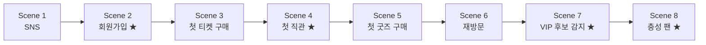

# 04_DEMO.md — Cloud Alpacas Demo Story & 발표 시나리오

> 이 문서는 Demo Story, Screen, 발표 시나리오를 다룬다. Persona(김매니저·이루키)와
> Customer Journey의 근거는 `00_STORY.md`, 화면에 나오는 Object/Field 근거는
> `03_SYSTEM.md`다 — 이 문서는 그 둘을 **발표에서 보여줄 순서**로 엮는다.
> Sample Data의 실제 값(이름, 날짜, 수치)은 이 문서가 아니라 `docs/data/`에서
> 관리한다(CLAUDE.md §7 중복 방지) — 이 문서에는 "어떤 데이터가 필요한가"만 적는다.

---

## 1. Demo 방식 — Hybrid Demo

Cloud Alpacas Demo는 두 부분을 섞는다.

| 파트 | 방식 | 이유 |
|---|---|---|
| 이루키의 행동 (로그인, 티켓 구매, 체크인, 굿즈 구매) | **짧은 영상** | Fan App은 이번 프로젝트의 주인공이 아니라 Demo용 데이터 생성 채널이다(CLAUDE.md §5). 영상으로 빠르게 맥락만 보여준다. |
| 김매니저의 화면 (Dashboard, Fan 360, Recommendation, Flow) | **실제 Salesforce Org 라이브 클릭** | Demo의 핵심은 Salesforce Customer 360이다. 실제로 동작하는 것을 보여줘야 설득력이 있다. |

**백업 계획**: 네트워크·환경 문제에 대비해 동일한 시나리오의 라이브 클릭 부분도
녹화 영상으로 미리 준비해둔다.

---

## 2. Scene 구조 — 모듈형 설계

Demo 발표 시간이 아직 확정되지 않았기 때문에, Demo Story를 **독립적인 Scene 단위**로
쪼갠다. 발표 시간에 맞춰 Scene을 빼거나 더할 수 있다.

| 시간 | 구성 |
|---|---|
| 5분 Demo | **Core** 표시된 4개 Scene만 |
| 10분 Demo | 전체 8개 Scene (Fan Journey 전체) |

★ = Core Scene (5분 Demo에 포함)

---

## 3. Scene 상세

### Scene 1 — SNS (Extended)

- **Fan App 파트**: 이루키가 SNS에서 문선수의 하이라이트 영상을 보고 관심을 갖는 장면(영상).
- **Salesforce 파트**: 없음 (아직 Fan 레코드가 없다 — Pain Point: 팬이 되기 전 단계는
  아직 우리 시스템 밖의 일이다).
- **멘트 포인트**: "이루키는 아직 우리 데이터에 없습니다. 하지만 다음 장면에서 가입하는
  순간, 우리는 이루키가 SNS를 통해 왔다는 것도 함께 기록합니다."

### Scene 2 — 회원가입 (Core ★)

- **Fan App 파트**: 이루키가 Fan App에 가입하는 장면(영상). 가입 채널로 "SNS" 선택.
- **Salesforce 파트(라이브)**:
  1. Fan 360 Dashboard에서 신규 Fan(이루키) 레코드 확인 — `Acquisition_Channel__c` =
     SNS, `Current_Segment__c` = New Fan.
  2. Flow(03_SYSTEM.md §4.4 Welcome Campaign Flow)가 이미 실행되어 `Notification_Log__c`에
     Welcome 안내가 기록된 것을 Fan Timeline에서 확인.
- **멘트 포인트**: "가입하자마자 시스템이 자동으로 이루키를 New Fan으로 분류하고, Welcome
  안내를 보냈습니다 — 사람이 엑셀을 정리할 필요가 없습니다."

### Scene 3 — 첫 티켓 구매 (Extended)

- **Fan App 파트**: 이루키가 친구와 함께 볼 경기 티켓을 구매하는 장면(영상).
- **Salesforce 파트 (라이브)**: Order(Ticket Purchase) 레코드와 OrderItem의 좌석 정보를
  Fan Timeline에서 확인.
- **멘트 포인트**: "티켓, 좌석, 경기 정보가 모두 이루키 레코드 하나에 연결됩니다."

### Scene 4 — 첫 직관 (Core ★)

- **Fan App 파트**: 경기장 게이트에서 체크인하는 장면(영상).
- **Salesforce 파트 (라이브)**:
  1. `Admission__c` 레코드 생성 확인.
  2. `Current_Segment__c`가 New Fan → **Active Fan**으로 바뀐 것을 Fan 360 Dashboard에서
     확인 — `Fan_Segment_History__c`에 전환 이력이 남아있음을 함께 보여준다.
- **멘트 포인트**: "실제로 경기장에 온 순간, 이루키는 '활동하는 팬'으로 자동 전환됩니다."

### Scene 5 — 첫 굿즈 구매 (Extended)

- **Fan App 파트**: 이루키가 문선수 유니폼을 구매하는 장면(영상).
- **Salesforce 파트 (라이브)**: Order(Goods Purchase) 확인, Recommendation Panel에서
  Favorite Player Campaign 추천이 생성된 것을 확인 — `Favorite_Player__c` = 문선수와
  연결됨.
- **멘트 포인트**: "이루키가 문선수 유니폼을 산 것을 시스템이 인식하고, 최애 선수 기반
  추천을 자동으로 만듭니다."

### Scene 6 — 재방문 (Extended)

- **Fan App 파트**: 이루키가 몇 차례 더 경기장을 찾는 장면(영상, 여러 Admission을 빠르게
  몽타주로).
- **Salesforce 파트 (라이브)**: `Fan_Activity_Pattern__c`가 갱신되어 재방문 횟수·누적
  지출이 쌓이는 것을 확인.
- **멘트 포인트**: "한 번의 방문이 아니라, 누적된 패턴을 시스템이 계속 지켜보고 있습니다."

### Scene 7 — VIP 후보 감지 (Core ★)

- **Fan App 파트**: 없음 (이 장면은 순수하게 Salesforce의 자동화를 보여주는 장면).
- **Salesforce 파트 (라이브)**:
  1. `Fan_Activity_Pattern__c`가 조건(재방문 3회 이상 + 누적 지출 임계값)을 충족하는
     순간, VIP 후보 감지 Flow(03_SYSTEM.md §4.5)가 실행된다.
  2. `Recommendation__c`(Membership Campaign)이 생성된 것을 확인.
  3. **Slack 채널**에 "이루키님이 VIP 후보입니다" 알림이 도착한 것을 실시간으로 보여준다.
- **멘트 포인트**: "Pain Point 4번, 기억하시나요 — VIP가 될 가능성이 높은 팬을 엑셀
  정리 후에야 발견하던 문제. 지금은 그 순간 김매니저의 Slack으로 알림이 옵니다."
  *(이 Scene이 Demo 전체에서 가장 중요한 "Aha 모먼트"다.)*

### Scene 8 — 충성 팬 (Core ★)

- **Fan App 파트**: 이루키가 멤버십에 가입하는 장면(영상).
- **Salesforce 파트 (라이브)**:
  1. Order(Membership Enrollment) 생성 확인.
  2. Fan 360 Dashboard에서 이루키의 전체 여정(가입 → 티켓 → 직관 → 굿즈 → 재방문 →
     멤버십)이 Fan Timeline 하나에 모두 연결되어 보이는 최종 화면을 보여준다.
- **멘트 포인트**: "SNS에서 시작한 관심이, 충성 팬이 되기까지의 전 과정이 하나의 화면에
  담겨 있습니다 — 이게 저희가 만든 Customer 360입니다."

---

## 4. 화면(Screen) 목록

Demo에서 실제로 열어 보여줄 화면. 근거 Object는 `03_SYSTEM.md`를 참고한다.

| 화면 | 등장 Scene | 보여주는 것 |
|---|---|---|
| Fan 360 Dashboard | 2, 4, 8 | Fan 목록, Current Segment(Life Cycle) 현황, 오늘의 Recommendation |
| Fan Profile | 2, 5, 8 | 이루키 개인 정보(`Favorite_Player__c`, `Acquisition_Channel__c`, Consent 필드) + Fan을 이해하기 위한 핵심 현재값/요약값(`05_DECISIONS.md` Decision 009·010) — **원본은 각 Object에서 조회/집계하고, Person Account에 중복 저장하지 않는다**: 최근 관람일·총 관람 횟수(`Attendance_Record__c` 집계), 총 구매금액/구매 빈도(Order/OrderItem 집계), 최근 활동일(Engagement Signal/Order/Admission 중 최신 — Fan Timeline 최상단), Membership 가입 여부(Order, `Order_Type__c` = Membership Enrollment), Engagement Level(`Engagement_Level__c`), Engagement Score(`Engagement_Score__c` — 계산 공식 TBD), Fan Value(`Fan_Value_Tier__c`), Current Segment(`Current_Segment__c`) |
| Fan Timeline | 2, 3, 4, 8 | Admission·Order·Notification Log 등 이력을 시간순으로 |
| Recommendation Panel | 5, 7 | `Recommendation__c` 목록과 상태(Pending/Executed) |
| Slack 채널 | 7 | Flow가 보낸 내부 업무 알림 |

---

## 5. Sample Data 요구사항

Demo가 자연스럽게 이어지려면 아래 데이터가 **미리 준비**되어 있어야 한다. 실제 값(정확한
날짜, 이름 등)은 `docs/data/SAMPLE_DATA.md`, `docs/data/DEMO_DATASETS.md`에서 관리한다.

- 이루키 Fan 레코드 1건 (Acquisition_Channel__c = SNS, Favorite_Player__c = 문선수)
- 문선수 Player(Contact) 레코드 1건, 문선수 관련 Goods(Product2) 1건 이상
- Ticket Purchase(Order) 1건 이상, 관련 Game__c 레코드
- Admission__c 3건 이상 (Scene 6 "재방문"이 자연스럽도록 — 날짜를 분산)
- Goods Purchase(Order) 1건
- Fan_Activity_Pattern__c가 VIP 후보 조건을 충족하도록 누적된 수치
- Membership Enrollment(Order) 1건 (Scene 8 결과로 생성되거나, 미리 준비 후 라이브로 트리거)

---

## 6. Future Scope

- Demo 시간이 확정되면, 이 문서에 실제 발표 시간(예: "10분 확정")과 최종 Scene 조합을
  추가로 기록한다.
- 리허설 후 대사(멘트)는 실제 발표에 맞게 다듬는다 — 이 문서의 멘트 포인트는 초안이다.
