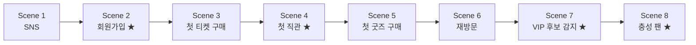

# 04_DEMO.md — Cloud Alpacas Demo Story & 발표 시나리오 [DRAFT — Phase 2 포함]

> **Status: DRAFT.** 이 문서는 원래 8/14 Phase 1 B2C Demo 계획이었다(§1~§6, 완료·보존).
> 현재는 그 다음 단계 — **B2C Fan 360 고도화 + Phase 2 B2B Collaboration/Sponsorship
> Expansion까지 구현한 뒤, 실제 Business Story와 End-to-End Workflow가 처음부터
> 끝까지 제대로 이어지는지 검증하기 위한 Demo Plan**으로 §7부터 재정의한다.
> **9/4 발표를 위한 계획이 아니다** — 발표 일정이 확정되면 그때 별도로 기록한다.
> §7 이후는 `03_SYSTEM.md §7`의 Technical Decision(A~K, 화요일 회의)이 아직
> 확정되지 않은 상태를 전제로 한 DRAFT다.

> 이 문서는 Demo Story, Screen, 발표 시나리오를 다룬다. Persona(김매니저·이루키)와
> Customer Journey의 근거는 `00_STORY.md`, 화면에 나오는 Object/Field 근거는
> `03_SYSTEM.md`다 — 이 문서는 그 둘을 **발표에서 보여줄 순서**로 엮는다.
> Sample Data의 실제 값(이름, 날짜, 수치)은 이 문서가 아니라 `docs/data/`에서
> 관리한다(CLAUDE.md §7 중복 방지) — 이 문서에는 "어떤 데이터가 필요한가"만 적는다.

---

## 1. Demo 방식 — Hybrid Demo

Cloud Alpacas Demo는 두 부분을 섞는다.

| 파트 | 방식 | 이유 |
|---|---|---|
| 이루키의 행동 (로그인, 티켓 구매, 체크인, 굿즈 구매) | **짧은 영상** | Fan App은 이번 프로젝트의 주인공이 아니라 Demo용 데이터 생성 채널이다(CLAUDE.md §5). 영상으로 빠르게 맥락만 보여준다. |
| 김매니저의 화면 (Dashboard, Fan 360, Recommendation, Flow) | **실제 Salesforce Org 라이브 클릭** | Demo의 핵심은 Salesforce Customer 360이다. 실제로 동작하는 것을 보여줘야 설득력이 있다. |

**백업 계획**: 네트워크·환경 문제에 대비해 동일한 시나리오의 라이브 클릭 부분도
녹화 영상으로 미리 준비해둔다.

---

## 2. Scene 구조 — 모듈형 설계

Demo 발표 시간이 아직 확정되지 않았기 때문에, Demo Story를 **독립적인 Scene 단위**로
쪼갠다. 발표 시간에 맞춰 Scene을 빼거나 더할 수 있다.

| 시간 | 구성 |
|---|---|
| 5분 Demo | **Core** 표시된 4개 Scene만 |
| 10분 Demo | 전체 8개 Scene (Fan Journey 전체) |

★ = Core Scene (5분 Demo에 포함)

---

## 3. Scene 상세

### Scene 1 — SNS (Extended)

- **Fan App 파트**: 이루키가 SNS에서 문선수의 하이라이트 영상을 보고 관심을 갖는 장면(영상).
- **Salesforce 파트**: 없음 (아직 Fan 레코드가 없다 — Pain Point: 팬이 되기 전 단계는
  아직 우리 시스템 밖의 일이다).
- **멘트 포인트**: "이루키는 아직 우리 데이터에 없습니다. 하지만 다음 장면에서 가입하는
  순간, 우리는 이루키가 SNS를 통해 왔다는 것도 함께 기록합니다."

### Scene 2 — 회원가입 (Core ★)

- **Fan App 파트**: 이루키가 Fan App에 가입하는 장면(영상). 가입 채널로 "SNS" 선택.
- **Salesforce 파트(라이브)**:
  1. Fan 360 Dashboard에서 신규 Fan(이루키) 레코드 확인 — `Acquisition_Channel__c` =
     SNS, `Current_Segment__c` = New Fan.
  2. Flow(03_SYSTEM.md §4.4 Welcome Campaign Flow)가 이미 실행되어 `Notification_Log__c`에
     Welcome 안내가 기록된 것을 Fan Timeline에서 확인.
- **멘트 포인트**: "가입하자마자 시스템이 자동으로 이루키를 New Fan으로 분류하고, Welcome
  안내를 보냈습니다 — 사람이 엑셀을 정리할 필요가 없습니다."

### Scene 3 — 첫 티켓 구매 (Extended)

- **Fan App 파트**: 이루키가 친구와 함께 볼 경기 티켓을 구매하는 장면(영상).
- **Salesforce 파트 (라이브)**: Order(Ticket Purchase) 레코드와 OrderItem의 좌석 정보를
  Fan Timeline에서 확인.
- **멘트 포인트**: "티켓, 좌석, 경기 정보가 모두 이루키 레코드 하나에 연결됩니다."

### Scene 4 — 첫 직관 (Core ★)

- **Fan App 파트**: 경기장 게이트에서 체크인하는 장면(영상).
- **Salesforce 파트 (라이브)**:
  1. `Admission__c` 레코드 생성 확인.
  2. `Current_Segment__c`가 New Fan → **Active Fan**으로 바뀐 것을 Fan 360 Dashboard에서
     확인 — `Fan_Segment_History__c`에 전환 이력이 남아있음을 함께 보여준다.
- **멘트 포인트**: "실제로 경기장에 온 순간, 이루키는 '활동하는 팬'으로 자동 전환됩니다."

### Scene 5 — 첫 굿즈 구매 (Extended)

- **Fan App 파트**: 이루키가 문선수 유니폼을 구매하는 장면(영상).
- **Salesforce 파트 (라이브)**: Order(Goods Purchase) 확인, Recommendation Panel에서
  Favorite Player Campaign 추천이 생성된 것을 확인 — `Favorite_Player__c` = 문선수와
  연결됨.
- **멘트 포인트**: "이루키가 문선수 유니폼을 산 것을 시스템이 인식하고, 최애 선수 기반
  추천을 자동으로 만듭니다."

### Scene 6 — 재방문 (Extended)

- **Fan App 파트**: 이루키가 몇 차례 더 경기장을 찾는 장면(영상, 여러 Admission을 빠르게
  몽타주로).
- **Salesforce 파트 (라이브)**: `Fan_Activity_Pattern__c`가 갱신되어 재방문 횟수·누적
  지출이 쌓이는 것을 확인.
- **멘트 포인트**: "한 번의 방문이 아니라, 누적된 패턴을 시스템이 계속 지켜보고 있습니다."

### Scene 7 — VIP 후보 감지 (Core ★)

- **Fan App 파트**: 없음 (이 장면은 순수하게 Salesforce의 자동화를 보여주는 장면).
- **Salesforce 파트 (라이브)**:
  1. `Fan_Activity_Pattern__c`가 조건(재방문 3회 이상 + 누적 지출 임계값)을 충족하는
     순간, VIP 후보 감지 Flow(03_SYSTEM.md §4.5)가 실행된다.
  2. `Recommendation__c`(Membership Campaign)이 생성된 것을 확인.
  3. **Slack 채널**에 "이루키님이 VIP 후보입니다" 알림이 도착한 것을 실시간으로 보여준다.
- **멘트 포인트**: "Pain Point 4번, 기억하시나요 — VIP가 될 가능성이 높은 팬을 엑셀
  정리 후에야 발견하던 문제. 지금은 그 순간 김매니저의 Slack으로 알림이 옵니다."
  *(이 Scene이 Demo 전체에서 가장 중요한 "Aha 모먼트"다.)*

### Scene 8 — 충성 팬 (Core ★)

- **Fan App 파트**: 이루키가 멤버십에 가입하는 장면(영상).
- **Salesforce 파트 (라이브)**:
  1. Order(Membership Enrollment) 생성 확인.
  2. Fan 360 Dashboard에서 이루키의 전체 여정(가입 → 티켓 → 직관 → 굿즈 → 재방문 →
     멤버십)이 Fan Timeline 하나에 모두 연결되어 보이는 최종 화면을 보여준다.
- **멘트 포인트**: "SNS에서 시작한 관심이, 충성 팬이 되기까지의 전 과정이 하나의 화면에
  담겨 있습니다 — 이게 저희가 만든 Customer 360입니다."

---

## 4. 화면(Screen) 목록

Demo에서 실제로 열어 보여줄 화면. 근거 Object는 `03_SYSTEM.md`를 참고한다.

| 화면 | 등장 Scene | 보여주는 것 |
|---|---|---|
| Fan 360 Dashboard | 2, 4, 8 | Fan 목록, Current Segment(Life Cycle) 현황, 오늘의 Recommendation |
| Fan Profile | 2, 5, 8 | 이루키 개인 정보(`Favorite_Player__c`, `Acquisition_Channel__c`, Consent 필드) + Fan을 이해하기 위한 핵심 현재값/요약값(`05_DECISIONS.md` Decision 009·010) — **원본은 각 Object에서 조회/집계하고, Person Account에 중복 저장하지 않는다**: 최근 관람일·총 관람 횟수(`Attendance_Record__c` 집계), 총 구매금액/구매 빈도(Order/OrderItem 집계), 최근 활동일(Engagement Signal/Order/Admission 중 최신 — Fan Timeline 최상단), Membership 가입 여부(Order, `Order_Type__c` = Membership Enrollment), Engagement Level(`Engagement_Level__c`), Engagement Score(`Engagement_Score__c` — 계산 공식 TBD), Fan Value(`Fan_Value_Tier__c`), Current Segment(`Current_Segment__c`) |
| Fan Timeline | 2, 3, 4, 8 | Admission·Order·Notification Log 등 이력을 시간순으로 |
| Recommendation Panel | 5, 7 | `Recommendation__c` 목록과 상태(Pending/Executed) |
| Slack 채널 | 7 | Flow가 보낸 내부 업무 알림 |

---

## 5. Sample Data 요구사항

Demo가 자연스럽게 이어지려면 아래 데이터가 **미리 준비**되어 있어야 한다. 실제 값(정확한
날짜, 이름 등)은 `docs/data/SAMPLE_DATA.md`, `docs/data/DEMO_DATASETS.md`에서 관리한다.

- 이루키 Fan 레코드 1건 (Acquisition_Channel__c = SNS, Favorite_Player__c = 문선수)
- 문선수 Player(Contact) 레코드 1건, 문선수 관련 Goods(Product2) 1건 이상
- Ticket Purchase(Order) 1건 이상, 관련 Game__c 레코드
- Admission__c 3건 이상 (Scene 6 "재방문"이 자연스럽도록 — 날짜를 분산)
- Goods Purchase(Order) 1건
- Fan_Activity_Pattern__c가 VIP 후보 조건을 충족하도록 누적된 수치
- Membership Enrollment(Order) 1건 (Scene 8 결과로 생성되거나, 미리 준비 후 라이브로 트리거)

---

## 6. Future Scope

- Demo 시간이 확정되면, 이 문서에 실제 발표 시간(예: "10분 확정")과 최종 Scene 조합을
  추가로 기록한다.
- 리허설 후 대사(멘트)는 실제 발표에 맞게 다듬는다 — 이 문서의 멘트 포인트는 초안이다.

---

## 7. [P2] DRAFT — Post Phase 1 / Phase 2 Demo 개요

Phase 1 Demo와 현재 Demo는 목적이 다르다. Phase 1 Demo(§1~§6)는 그대로 보존하고,
아래는 별도의 새 Demo Plan이다.

| | Phase 1 Demo (§1~§6, 완료) | 현재 Demo (§7~, DRAFT) |
|---|---|---|
| 목적 | B2C Fan 360 MVP를 8/14에 발표 | B2C 고도화 + B2B가 실제로 하나의 Story로 이어지는지 검증 |
| Persona | 김매니저 · 이루키 | 김매니저(B2C) + **이 매니저**(B2B) |
| 흐름 | Fan App Event → Salesforce Customer 360 → Fan Profile/Timeline → Recommendation → Flow/Slack | B2C Fan 360 고도화 → Fan Insight/Fan Grouping → B2B Partner Candidate Discovery → Lead → Account/Contact → Opportunity → Product/Quote → Campaign/Collaboration → Performance → 장기 Partnership/Sponsorship 판단 |
| 기술 상태 | 확정(Decision 001~014) | 상당 부분 DRAFT(`03_SYSTEM.md §7` A~K, 화요일 회의 전) |

---

## 8. [P2] Core End-to-End Scenario

Demo는 "화면을 다 보여주는 것"이 아니라, **하나의 Business Story가 처음부터 끝까지
끊기지 않고 이어지는지**를 검증한다.

**B2C**: 김매니저가 Fan 360에서 팬을 이해한다 → Fan의 행동/Engagement/Fan Value를
확인한다 → Fan Grouping/Fan Insight를 확인한다.

**B2B**: 이 매니저가 Fan Insight를 확인한다 → 어떤 팬층이 Cloud Alpacas와 함께
성장하고 있는지 발견한다 → 그 팬층과 궁합이 좋은 기업/브랜드 후보를 찾는다 → 후보를
Lead로 관리한다 → Account/Contact로 관계를 발전시킨다 → Opportunity를 만든다 →
Collaboration/Campaign을 실행한다 → 성과를 확인한다 → 장기 Partnership/Sponsorship으로
발전시킬지 판단한다.

---

## 9. [P2] Scene 상세

각 화면을 "보여주는 것"이 아니라 **이 사람이 이 질문을 가지고 이 화면에 들어갔을 때,
무엇을 보고, 무슨 판단을 하고, 다음 Action으로 넘어가는가**를 기준으로 정리한다.
⭐️ 표시는 `03_SYSTEM.md §7`에서 아직 Technical Decision이 확정되지 않은 부분이다.

| Scene | Persona | Business Question | Action | Salesforce Result | 화면에서 확인할 것 | Required Data |
|---|---|---|---|---|---|---|
| B2C-1. 팬 전체 조망 | 김매니저 | 우리 팬은 지금 어떤 상태인가? | Fan 360 Dashboard 조회 | Person Account 필드 기반 분포 | Current Segment/Engagement Level/Fan Value 분포 | 여러 세그먼트에 걸친 Fan 다수(§10 참고) |
| B2C-2. Fan Insight/Grouping ⭐️ | 김매니저 → 이 매니저 | 특정 팬층이 뚜렷한 특징을 보이는가? | Report/Report Type 조회(연령대×성별×관심사×Engagement) | 그룹별 집계 결과 | "○○명, 최근 3개월 증가율, 선호 카테고리" 같은 요약 | `Gender__c`/`Birthdate`/`Favorite_Player__c`/`Engagement_Signal__c` 채워진 Fan 다수 — 화면 구현 방식은 `03_SYSTEM.md §7 J` TBD |
| B2B-1. Business Fit 가설 | 이 매니저 | 이 팬층과 궁합 좋은 기업은? | Insight 확인 후 가설 수립(사람의 판단) | 없음(자동화 아님) | 후보 기업 리스트(가설 단계) | B2C-2의 Fan Insight 결과 |
| B2B-2. Partner Candidate ⭐️ | 이 매니저 | 실제로 접촉할 가치가 있는 후보인가? | 후보 등록/조회 | 후보 레코드(Object 형태 TBD) | 후보 점수·근거 | `03_SYSTEM.md §7 A`(Partner Candidate) 결정 대기 |
| B2B-3. Lead | 이 매니저 | 이 후보에게 접촉을 시작하는가? | Lead 생성, Status 변경 | Lead 레코드 | Lead List/Detail, Lead Score(⭐️ `§7 E`) | 후보 기업 정보 |
| B2B-4. Account/Contact 전환 | 이 매니저 | 누구와 논의를 이어가는가? | Convert Lead | Account+Contact(+Opportunity) 생성 | Account Detail, Related Contacts | 전환된 Lead |
| B2B-5. Opportunity | 이 매니저 | 이 제휴를 추진할 것인가? | Stage 변경(Kanban) | Opportunity Stage 진행 | Stage Kanban, Amount, Probability | Opportunity, Product(Sponsorship Package) |
| B2B-6. Product/Quote ⭐️ | 이 매니저 | 무엇을, 얼마에 제안하는가? | 라인업 확정, 제안서 준비 | Product 연결(+Quote는 `§7 C` TBD) | Products Related List(+Quote는 TBD) | Sponsorship Package(Product2) |
| B2B-7. Collaboration/Campaign ⭐️ | 이 매니저 | 실제로 무엇을 함께 실행하는가? | Campaign 생성/연결 | Campaign 레코드 | Campaign Related List | Campaign — RecordType vs Lookup은 `§7 D` TBD |
| B2B-8. Performance | 이 매니저 | 효과가 있었는가? | Report/Dashboard 조회 | 성과 지표 | Pipeline/Won Revenue/전환 지표 | Order/Campaign 성과 데이터 |
| B2B-9. 장기 Partnership 판단 | 이 매니저 | 장기 계약으로 발전시킬 것인가? | Opportunity Closed Won → 장기 계약 검토 | Account 상태 변화(Active Partner) | Account Detail, Sponsor Contract(TBD) | 성과 데이터 + Sponsor Contract 개념(§4 기존, Object 구현 TBD) |

---

## 10. [P2] Demo Data 규모 검토

### 현재 상태

Org에는 Fan이 약 20명 있고, `docs/data/SAMPLE_DATA_v2_1.md`에 상세히 정의된 것은
5명(이루키·박서연·김도현·최민재·정하윤)이다. 이 5명은 **"Picklist 값이 최소 1번씩
동작하는지" 검증용**으로 설계되어 있다 — Current Segment 5종, Fan Value 3종,
Engagement Level 5종이 각각 1명씩만 배정되어 있다.

### 무엇이 부족한지

- **`Gender__c`/`Birthdate` 값 자체가 어떤 샘플에도 채워져 있지 않다** — Fan
  Grouping/Insight를 성별·연령으로 보여주는 Demo는 지금 데이터로는 아예 불가능하다.
- 조합마다 사람이 1명뿐이라 "그룹"이라는 표현이 성립하지 않는다 — 예를 들어 지금
  구조로는 "20~30대 여성 팬 2,140명" 같은 화면을 만들 수 없고, "20~30대 여성 팬
  1명"만 보여줄 수 있다.
- `Engagement_Signal__c`가 팬당 1~2건뿐이라, "선호 굿즈 카테고리"·"관심사" 같은
  집계형 분석에는 근거가 부족하다.
- 시간에 따른 변화(예: "최근 3개월 관람 증가율")를 보여주려면 여러 달에 걸쳐
  분산된 이벤트 데이터가 필요한데, 현재는 특정 시즌 한 시점에 몰려 있다.

### 규모 제안 (Demo Proposal — 확정 아님)

| 단계 | 목적 | 규모 제안 | 근거 |
|---|---|---|---|
| **Minimum** | 화면/Flow가 깨지지 않고 동작하는지 검증 | 현재 수준(5~10명, Picklist 값 1회 이상) | 이미 갖춰짐 — "그룹"을 보여줄 수는 없음 |
| **Recommended** | Fan Grouping/Insight가 "의미 있는 그룹"으로 보임 | 총 30~50명, 대표 세그먼트(예: 특정 연령대×성별) 1개당 5명 이상 | "그룹"이라는 표현이 성립하려면 한 조합에 최소 5명은 필요, 대표 세그먼트 3~4개 노출 기준 |
| **Ideal** | B2B Partner Candidate 추천까지 자연스럽게 설득력 있음 | 총 60~100명 + 2~3개월 이상 시간 분산된 Admission/Order | 세그먼트 간 규모 차이 + 증가 추세("최근 3개월 +24%" 같은 표현)를 보여주려면 시계열 데이터 필요 |

Fan 수뿐 아니라 관련 Record도 함께 늘어나야 한다: Order/OrderItem, Admission,
Attendance_Record, Fan_Activity_Pattern, Engagement_Signal, Recommendation,
Benefit, Campaign/CampaignMember — Fan 1명이 늘면 이 Record들도 비례해서 늘어야
"팬 하나의 여정"이 아니라 "팬층의 패턴"이 보인다. 정확한 배율은 팀 확인 필요
(TBD) — 실제 값과 비율은 `data/DEMO_DATA_STANDARD.md` §6.4에서 관리한다.

---

## 11. [P2] 공용 Dummy Data 기준

팀 전체가 같은 규칙으로 Demo Data를 만들기 위한 공용 기준(Naming Rule, Fan 분포,
Cross-Object 일관성, 담당자, Freeze 절차)은 `docs/data/DEMO_DATA_STANDARD.md`에서
관리한다(CLAUDE.md §7 중복 방지 — 이 문서에는 반복하지 않는다).

---

## 12. [P2] Future Scope / 미확정 사항

- Partner Candidate Object 여부, AI Matching 방식, Quote 사용 여부, Collaboration
  구현 방식 등은 `03_SYSTEM.md §7`의 화요일 회의 결과를 따른다.
- 발표 일정·시간은 아직 확정되지 않았다.
- Fan Data 실제 증분(§10 Recommended/Ideal)은 팀이 실제로 만들지 결정한 뒤 진행한다
  — 이번 문서는 규모만 제안했을 뿐 실제 Dummy Data를 생성하지 않았다.
